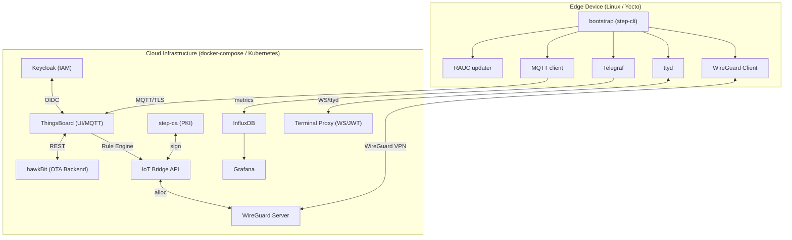

# Complete Device Management

> An enterprise-grade, open-source **IoT Device & Software Lifecycle Management Platform** — a self-hosted alternative to Mender.io Enterprise.

[](https://github.com/the78mole/complete-device-management/actions/workflows/ci.yml)
[](https://the78mole.github.io/complete-device-management/)
[](https://www.python.org/)
[](https://nodejs.org/)
[](https://docs.docker.com/compose/)
[](LICENSE)

---

## What Is This?

**complete-device-management** is a monorepo that scaffolds and implements a complete IoT lifecycle management platform from scratch using only open-source components. It provides:

- **Zero-Touch Device Provisioning** — devices boot, generate a key pair, enroll against a private CA (smallstep), receive a signed mTLS certificate, and are automatically registered in the platform.
- **Secure OTA Updates** — Eclipse hawkBit manages software campaigns; `rauc-hawkbit-updater` on devices executes RAUC A/B OS updates.
- **Remote Troubleshooting** — WireGuard VPN + `ttyd` web terminal, proxied securely through a JWT-validated WebSocket gateway and embedded in the ThingsBoard UI.
- **High-Frequency Telemetry** — Telegraf → InfluxDB pipeline bypasses ThingsBoard's DB for performance; Grafana dashboards are embedded via iframes.
- **Single Sign-On** — Keycloak OIDC/SAML connects ThingsBoard, hawkBit, and Grafana into a unified login experience.
- **Private PKI** — smallstep `step-ca` acts as Root CA + Intermediate CA + ACME provisioner for all service and device certificates.

---

## Architecture Overview



---

## Technology Stack

| Layer | Component | Role |
|---|---|---|
| IAM | [Keycloak](https://www.keycloak.org/) | OIDC/SAML SSO for all services |
| IoT Platform | [ThingsBoard CE](https://thingsboard.io/) | Device registry, MQTT broker, Rule Engine, UI |
| OTA Backend | [Eclipse hawkBit](https://eclipse.dev/hawkbit/) | Software campaign management |
| PKI | [smallstep step-ca](https://smallstep.com/docs/step-ca/) | Root CA, intermediate CA, ACME, device cert signing |
| Time-Series DB | [InfluxDB v2](https://www.influxdata.com/) | High-frequency telemetry |
| Visualization | [Grafana](https://grafana.com/) | Dashboard for InfluxDB metrics |
| VPN | [WireGuard](https://www.wireguard.com/) | Zero-trust device tunnel |
| Web Terminal | [ttyd](https://github.com/tsl0922/ttyd) + Terminal Proxy | Secure browser-based shell |
| OTA Agent | [RAUC](https://rauc.io/) + rauc-hawkbit-updater | A/B OS update execution |
| Telemetry | [Telegraf](https://www.influxdata.com/time-series-platform/telegraf/) | Metric collection & forwarding |
| Glue Services | Python [FastAPI](https://fastapi.tiangolo.com/) + Node.js | Integration microservices |
| IaC | Docker Compose + Kubernetes Helm | Local eval + production deploy |

---

## Repository Structure

```
├── .github/
│   ├── workflows/          # CI (tests, lint, docs build) + gh-pages deploy
│   └── ISSUE_TEMPLATE/     # Bug report & feature request forms
├── cloud-infrastructure/   # All cloud-side service configs
│   ├── docker-compose.yml  # Master compose for local evaluation
│   ├── keycloak/           # Realm export, Dockerfile
│   ├── thingsboard/        # Rule chains, custom widgets, provision script
│   ├── hawkbit/            # application.properties
│   ├── step-ca/            # CA Dockerfile, cert templates, init script
│   ├── monitoring/         # InfluxDB init, Grafana provisioning
│   └── vpn-server/         # WireGuard server config
├── glue-services/
│   ├── iot-bridge-api/     # FastAPI: PKI enrollment, TB webhook, WireGuard alloc
│   └── terminal-proxy/     # Node.js/TS: JWT-validated WebSocket → ttyd proxy
├── device-stack/           # Edge device simulation
│   ├── docker-compose.yml  # Simulates a device running on localhost
│   ├── bootstrap/          # step-cli enroll script
│   ├── mqtt-client/        # mTLS MQTT telemetry publisher
│   ├── updater/            # hawkBit DDI poller (simulates RAUC)
│   ├── telegraf/           # telegraf.conf
│   ├── wireguard-client/   # WireGuard client container
│   ├── rauc/               # Reference RAUC system.conf
│   └── terminal/           # ttyd setup script
└── docs/                   # MkDocs source → ReadTheDocs / gh-pages
```

---

## Quick Start

### Prerequisites

- Docker ≥ 24 + Docker Compose ≥ 2.20
- `git`
- 8 GB RAM (16 GB recommended for all services simultaneously)

### 1. Clone & Configure

```bash
git clone https://github.com/the78mole/complete-device-management.git
cd complete-device-management/cloud-infrastructure
cp .env.example .env
# Edit .env – set all *_PASSWORD and STEP_CA_* variables
```

### 2. Start the Cloud Stack

```bash
docker compose up -d
```

This starts: step-ca, Keycloak + Postgres, ThingsBoard + Postgres, hawkBit + MySQL,
InfluxDB, Grafana, WireGuard server, iot-bridge-api, terminal-proxy.

### 3. Bootstrap ThingsBoard

```bash
docker compose exec thingsboard bash /provision/provision.sh
```

### 4. Simulate a Device

```bash
cd ../device-stack
cp .env.example .env
# Edit .env – point BRIDGE_API_URL to your cloud-side iot-bridge-api
docker compose up
```

The `bootstrap` container enrolls the device (generates key, signs cert via step-ca),
then all other services start automatically.

### 5. Access the UIs

| Service | URL | Default Credentials |
|---|---|---|
| ThingsBoard | http://localhost:8080 | admin@thingsboard.org / from .env |
| Keycloak | http://localhost:8180 | admin / from .env |
| Grafana | http://localhost:3000 | admin / from .env |
| hawkBit | http://localhost:8090 | admin / admin |
| iot-bridge-api docs | http://localhost:8000/docs | — |

---

## Documentation

Full documentation is available at **[https://the78mole.github.io/complete-device-management/](https://the78mole.github.io/complete-device-management/)**.

Topics covered:
- [Installation](https://the78mole.github.io/complete-device-management/installation/)
- [Getting Started](https://the78mole.github.io/complete-device-management/getting-started/)
- [Architecture](https://the78mole.github.io/complete-device-management/architecture/)
- [Workflows](https://the78mole.github.io/complete-device-management/workflows/device-provisioning/)
- [Use Cases](https://the78mole.github.io/complete-device-management/use-cases/)

---

## Contributing

We welcome contributions! Please read [CONTRIBUTING.md](CONTRIBUTING.md) before opening a pull request.

---

## License

[MIT](LICENSE) © the78mole contributors
