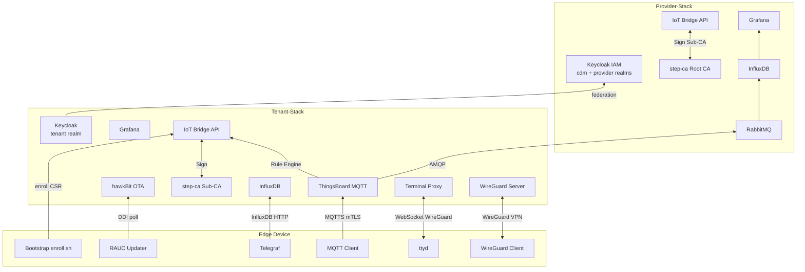

# Complete Device Management

> An enterprise-grade, open-source **IoT Device & Software Lifecycle Management Platform** — a self-hosted alternative to Mender.io Enterprise.

[](https://github.com/the78mole/complete-device-management/actions/workflows/ci.yml)
[](https://the78mole.github.io/complete-device-management/)
[](https://www.python.org/)
[](https://nodejs.org/)
[](https://docs.docker.com/compose/)
[](LICENSE)

[](https://codespaces.new/the78mole/complete-device-management)
[](https://vscode.dev/redirect?url=vscode://ms-vscode-remote.remote-containers/cloneInVolume?url=https://github.com/the78mole/complete-device-management)

---

## What Is This?

**complete-device-management** is a monorepo that scaffolds and implements a complete IoT lifecycle management platform from scratch using only open-source components.

The platform is split into two independently deployable stacks:

- **Provider-Stack** — operated by the CDM platform team. Provides the trust anchor (Root CA, Keycloak `cdm` realm), central message broker (RabbitMQ) and platform-wide observability (InfluxDB, Grafana).
- **Tenant-Stack** — one stack per customer. Provides device-facing services: ThingsBoard MQTT, hawkBit OTA, WireGuard VPN, Terminal Proxy, and tenant-scoped telemetry.

Key capabilities:

- **Zero-Touch Device Provisioning** — devices boot, generate a key pair, enroll against the Tenant step-ca Sub-CA, receive a signed mTLS certificate (chain to Provider Root CA), and are automatically registered in ThingsBoard and hawkBit.
- **Secure OTA Updates** — Eclipse hawkBit (Tenant-Stack) manages software campaigns; `rauc-hawkbit-updater` on devices executes RAUC A/B OS updates.
- **Remote Troubleshooting** — WireGuard VPN + `ttyd` web terminal, proxied securely through a JWT-validated WebSocket gateway embedded in the ThingsBoard UI (both in Tenant-Stack).
- **High-Frequency Telemetry** — Telegraf → Tenant InfluxDB pipeline bypasses ThingsBoard's DB for performance; aggregated metrics flow via RabbitMQ to Provider InfluxDB for fleet-wide dashboards.
- **Single Sign-On** — Keycloak realm federation links each Tenant Keycloak into the Provider `cdm` realm; one login across all services.
- **Private PKI** — Two-tier hierarchy: Provider Root CA → Provider Intermediate CA → Tenant Sub-CA → Device certificates.

---

## Architecture Overview



---

## Technology Stack

| Layer | Component | Stack | Role |
|---|---|---|---|
| Reverse Proxy | [Caddy](https://caddyserver.com/) | Both | Automatic HTTPS, path-based routing, entry point `:8888` |
| IAM | [Keycloak](https://www.keycloak.org/) | Both | OIDC SSO; Provider: `cdm`+`provider` realms; Tenant: tenant realm |
| Message Broker | [RabbitMQ](https://www.rabbitmq.com/) | Provider | Central MQTT/AMQP broker, vHost per tenant |
| IoT Platform | [ThingsBoard CE](https://thingsboard.io/) | Tenant | Device registry, MQTT broker, Rule Engine, UI |
| OTA Backend | [Eclipse hawkBit](https://eclipse.dev/hawkbit/) | Tenant | Software campaign management |
| PKI | [smallstep step-ca](https://smallstep.com/docs/step-ca/) | Both | Provider: Root+ICA; Tenant: Sub-CA for device certs |
| Time-Series DB | [InfluxDB v2](https://www.influxdata.com/) | Both | Provider: platform metrics; Tenant: device telemetry |
| Visualization | [Grafana](https://grafana.com/) | Both | Fleet dashboards (Provider) + device dashboards (Tenant) |
| VPN | [WireGuard](https://www.wireguard.com/) | Tenant | Zero-trust device tunnel |
| Web Terminal | [ttyd](https://github.com/tsl0922/ttyd) + Terminal Proxy | Tenant | Secure browser-based shell |
| OTA Agent | [RAUC](https://rauc.io/) + rauc-hawkbit-updater | Device | A/B OS update execution |
| Telemetry | [Telegraf](https://www.influxdata.com/time-series-platform/telegraf/) | Device | Metric collection & forwarding |
| Glue Services | Python [FastAPI](https://fastapi.tiangolo.com/) + Node.js | Both | IoT Bridge API + Terminal Proxy |
| IaC | Docker Compose | Both | Local evaluation and production deployment |

---

## Repository Structure

```
├── .github/
│   ├── workflows/          # CI (tests, lint, docs build) + gh-pages deploy
│   ├── skills/             # Keycloak runbook scripts + SKILL.md
│   └── ISSUE_TEMPLATE/     # Bug report & feature request forms
├── provider-stack/         # Provider-Stack: Caddy, Keycloak, RabbitMQ, InfluxDB, Grafana, step-ca
│   ├── docker-compose.yml
│   ├── caddy/              # Caddyfile, landing page
│   ├── keycloak/           # Realm templates (cdm + provider), init scripts
│   ├── monitoring/         # InfluxDB init, Grafana provisioning
│   ├── rabbitmq/           # RabbitMQ config, vHost definitions
│   └── step-ca/            # Root CA + ICA Dockerfile, cert templates
├── glue-services/
│   ├── iot-bridge-api/     # FastAPI: PKI enrollment, TB webhook, WireGuard alloc
│   └── terminal-proxy/     # Node.js/TS: JWT-validated WebSocket → ttyd proxy
├── device-stack/           # Edge device simulation
│   ├── docker-compose.yml
│   ├── bootstrap/          # enroll.sh — generates key, signs cert via Tenant Sub-CA
│   ├── mqtt-client/        # mTLS MQTT telemetry publisher
│   ├── updater/            # hawkBit DDI poller (simulates RAUC)
│   ├── telegraf/           # telegraf.conf
│   ├── wireguard-client/   # WireGuard client container
│   ├── rauc/               # Reference RAUC system.conf
│   └── terminal/           # ttyd setup script
└── docs/                   # MkDocs source → gh-pages
```

---

## Development Environment

The repository ships a fully configured **Dev Container** so you can explore and develop without installing anything locally — either in the browser via GitHub Codespaces or in your local VS Code.

### GitHub Codespaces

[](https://codespaces.new/the78mole/complete-device-management)

Clicking the button above (or the one in the header) provisions a cloud VM with everything pre-installed:

1. GitHub spins up an **Ubuntu 24.04** container with Docker CLI, Compose v2, and Python.
2. Ports **8888**, **9090**, **8086**, **1883** and **8883** are forwarded automatically — the Ports panel in VS Code shows them with friendly labels.
3. Port 8888 opens a browser tab automatically as soon as Caddy is reachable.
4. Construct service URLs as:
   ```
   https://<codespace-name>-<port>.app.github.dev
   ```
   **Example:** `https://fuzzy-fishstick-abc123-8888.app.github.dev/`
5. The environment variable `CODESPACE_NAME` is available inside the Codespace, so scripts can build URLs dynamically.

> Port visibility is set to **public** for port 8888 by default so the landing page opens without an extra login step. Adjust `.devcontainer/devcontainer.json` → `portsAttributes` to `"visibility": "private"` in sensitive environments.

### Local Dev Container (VS Code)

[](https://vscode.dev/redirect?url=vscode://ms-vscode-remote.remote-containers/cloneInVolume?url=https://github.com/the78mole/complete-device-management)

#### Linux

Linux is the recommended host OS — Docker runs natively, volumes are fast, and no extra virtualisation layer is involved.

1. Install [Docker Engine](https://docs.docker.com/engine/install/) (or Docker Desktop) and ensure your user is in the `docker` group:
   ```bash
   sudo usermod -aG docker $USER   # log out and back in afterwards
   ```
2. Install the [Dev Containers](https://marketplace.visualstudio.com/items?itemName=ms-vscode-remote.remote-containers) extension in VS Code.
3. Clone the repository:
   ```bash
   git clone https://github.com/the78mole/complete-device-management.git
   code complete-device-management
   ```
4. Click **Reopen in Container** when prompted (or run **Dev Containers: Reopen in Container** from the Command Palette).
5. VS Code builds the container from [`.devcontainer/devcontainer.json`](.devcontainer/devcontainer.json) and reopens the workspace inside it.

#### macOS

macOS works well with Docker Desktop. Performance is slightly lower than Linux due to the internal VM, but fully sufficient for development.

1. Install [Docker Desktop for Mac](https://www.docker.com/products/docker-desktop/) (Apple Silicon and Intel both supported).
2. Install the [Dev Containers](https://marketplace.visualstudio.com/items?itemName=ms-vscode-remote.remote-containers) extension in VS Code.
3. Clone the repository and open it in VS Code (same as Linux above).
4. Click **Reopen in Container** when prompted.

> **Tip:** In Docker Desktop → Settings → Resources, assign at least **6 GB RAM** and **4 CPUs** to the VM to keep the Provider-Stack responsive.

#### Windows

On Windows, Docker containers run inside WSL 2. The Dev Container setup handles this transparently, but a few extra steps are required first.

1. Enable **WSL 2** and install a Linux distribution (Ubuntu 24.04 recommended):
   ```powershell
   wsl --install -d Ubuntu-24.04
   ```
2. Install [Docker Desktop for Windows](https://www.docker.com/products/docker-desktop/) and enable **Use the WSL 2 based engine** in Settings → General.
3. In Docker Desktop → Settings → Resources → WSL Integration, enable Docker for your Ubuntu distribution.
4. Install the [Dev Containers](https://marketplace.visualstudio.com/items?itemName=ms-vscode-remote.remote-containers) extension in VS Code.
5. Open **VS Code** and run **WSL: Open Folder in WSL** to work inside your Ubuntu distribution (this avoids slow cross-filesystem I/O).
6. Clone the repository inside WSL:
   ```bash
   git clone https://github.com/the78mole/complete-device-management.git
   code complete-device-management   # opens VS Code connected to WSL
   ```
7. Click **Reopen in Container** when prompted.

> **Important:** Always clone and open the repository from the WSL filesystem (`/home/<user>/...`), **not** from a Windows path (`/mnt/c/...`). Cross-filesystem mounts are significantly slower and can cause permission issues with Docker volumes.

---

The Dev Container provides the same tooling on all platforms:

| Tool | Purpose |
|---|---|
| Docker CLI + Compose v2 | Build and run all Compose stacks (Docker-outside-of-Docker) |
| Python (latest stable) | IoT Bridge API development, `ruff`, `mypy`, `pytest` |
| Node.js (from PATH) | Terminal Proxy development |
| Git (latest, built from source) | Version control |
| `curl`, `wget`, `step` (via apt/path) | PKI operations, debugging |

All port forwarding rules defined above apply identically to the local Dev Container.

---

## Quick Start

### Prerequisites

> **Tip:** Skip all prerequisites by using the [Dev Container or Codespaces](#development-environment) above — Docker, Git and Python are already available.

- Docker ≥ 24 + Docker Compose ≥ 2.20
- `git`
- 6 GB RAM for the Provider-Stack (8 GB recommended)

### 1. Clone & Configure

```bash
git clone https://github.com/the78mole/complete-device-management.git
cd complete-device-management/provider-stack
cp .env.example .env
# Edit .env – set all *_PASSWORD and STEP_CA_* variables
```

### 2. Start the Provider-Stack

```bash
docker compose up -d
docker compose ps   # wait until all containers are healthy
```

This starts: Caddy, Keycloak + Postgres, RabbitMQ, InfluxDB, Grafana, step-ca (Root CA + ICA), IoT Bridge API.

### 3. Retrieve the Root CA Fingerprint

```bash
docker compose exec provider-step-ca step certificate fingerprint /home/step/certs/root_ca.crt
```

Save this value — the Device-Stack needs it for enrollment.

### 4. Start a Tenant-Stack

```bash
cd ../tenant-stack
cp .env.example .env
# Edit .env – set TENANT_ID, TENANT_DISPLAY_NAME, EXTERNAL_URL at minimum
docker compose up -d
```

See [Tenant-Stack Setup](https://the78mole.github.io/complete-device-management/installation/tenant-stack/) for the full step-by-step guide including Sub-CA initialisation and the JOIN workflow.

### 5. Simulate a Device

```bash
cd ../device-stack
cp .env.example .env
# Edit .env – DEVICE_ID=device-001, TENANT_API_URL=<tenant-iot-bridge-api-url>
docker compose up
```

The `bootstrap` container enrolls the device (generates key, signs cert via Tenant Sub-CA),
then all other services start automatically.

### 6. Access the Provider-Stack UIs

| Service | URL | Default Credentials |
|---|---|---|
| **Caddy entry point** | http://localhost:8888/ | — |
| Keycloak | http://localhost:8888/auth/admin/ | admin / from `.env` |
| Grafana | http://localhost:8888/grafana/ | admin / from `.env` |
| RabbitMQ Management | http://localhost:8888/rabbitmq/ | admin / from `.env` |
| IoT Bridge API docs | http://localhost:8888/api/docs | — |
| InfluxDB | http://localhost:8086/ | admin / from `.env` |
| step-ca | https://localhost:9000/health | — |

> **Codespaces:** Replace `http://localhost:8888` with `https://<codespace-name>-8888.app.github.dev`  
> (your `CODESPACE_NAME` appears in the terminal as part of the shell prompt; ports are listed in the VS Code **Ports** panel).

---

## Documentation

Full documentation is available at **[https://the78mole.github.io/complete-device-management/](https://the78mole.github.io/complete-device-management/)**.

Topics covered:
- [Installation](https://the78mole.github.io/complete-device-management/installation/)
- [Getting Started](https://the78mole.github.io/complete-device-management/getting-started/)
- [Architecture](https://the78mole.github.io/complete-device-management/architecture/)
- [Workflows](https://the78mole.github.io/complete-device-management/workflows/device-provisioning/)
- [Use Cases](https://the78mole.github.io/complete-device-management/use-cases/)

---

## Contributing

We welcome contributions! Please read [CONTRIBUTING.md](CONTRIBUTING.md) before opening a pull request.

---

## License

[MIT](LICENSE) © the78mole contributors
