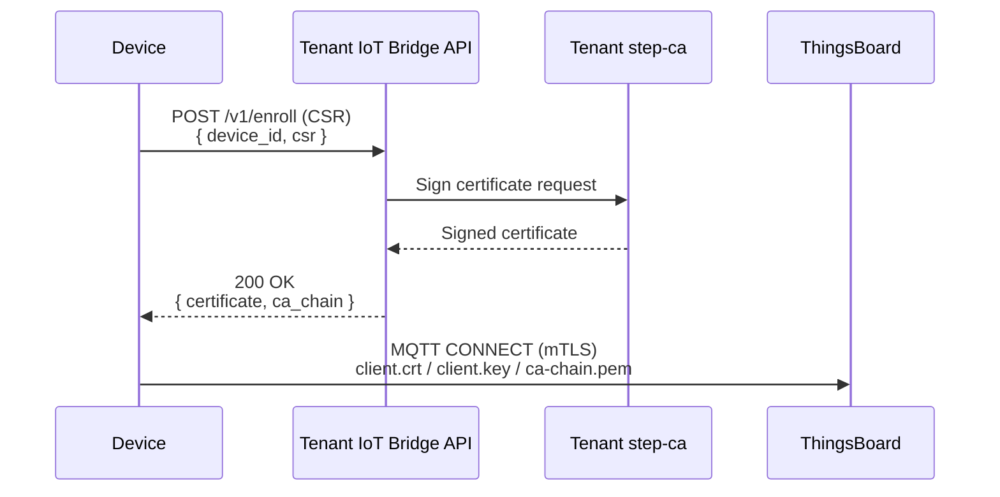

# device-stack – CDM Edge Device Implementations

This directory contains multiple implementations of the CDM device-side logic, each targeting a different runtime and/or hardware architecture.

| Variant | Directory | Description |
|---|---|---|
| **Docker-based** | [`docker-based/`](docker-based/) | Full feature simulation via Docker Compose — WireGuard, OTA updater, MQTT telemetry, Telegraf, ttyd terminal |
| **FreeRTOS POSIX (x86\_64)** | [`freertos-x86_64-posix/`](freertos-x86_64-posix/) | FreeRTOS running on the POSIX/Linux port; enrollment + mTLS only |
| **Linux QEMU (x86\_64)** | [`some-linux-x86_64-qemu/`](some-linux-x86_64-qemu/) | Minimal Linux (`busybox` initramfs) in QEMU x86\_64; enrollment + mTLS only |
| **Yocto RPi 4** | [`yocto-raspberrypi4/`](yocto-raspberrypi4/) | Yocto 5.0 LTS image for Raspberry Pi 4 (64-bit); enrollment + mTLS, systemd service |
| **Yocto RPi 4 + TPM** | [`yocto-raspberrypi4-tpm/`](yocto-raspberrypi4-tpm/) | Same as above + Infineon SLB9672 TPM 2.0; private key never leaves hardware |

## Feature Matrix

| Feature | docker-based | freertos-posix | linux-qemu | yocto-rpi4 | yocto-rpi4-tpm |
|---|:---:|:---:|:---:|:---:|:---:|
| PKI enrollment (CSR → signed cert) | ✅ | ✅ | ✅ | ✅ | ✅ |
| mTLS MQTT connection | ✅ | ✅ | ✅ | ✅ | ✅ |
| TPM-backed private key (SLB9672) | ❌ | ❌ | ❌ | ❌ | ✅ |
| systemd service | ❌ | ❌ | ❌ | ✅ | ✅ |
| WireGuard VPN client | ✅ | ❌ | ❌ | ❌ | ❌ |
| hawkBit OTA updater | ✅ | ❌ | ❌ | ❌ | ❌ |
| Telegraf telemetry | ✅ | ❌ | ❌ | ❌ | ❌ |
| ttyd web terminal | ✅ | ❌ | ❌ | ❌ | ❌ |

## Shared Prerequisites

All variants require a running **Tenant-Stack** with:

- The JOIN workflow completed (Tenant Sub-CA signed by Provider Root CA)
- The Tenant IoT Bridge API reachable from the device network
- `STEP_CA_FINGERPRINT` (Tenant Sub-CA) available — retrieve with:
  ```bash
  docker compose -f ../tenant-stack/docker-compose.yml exec ${TENANT_ID}-step-ca \
    step ca fingerprint
## Enrollment Flow (all variants)


