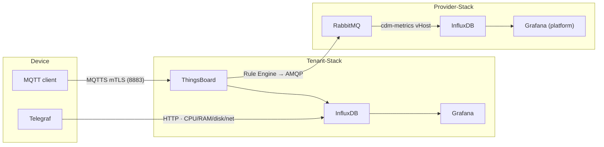
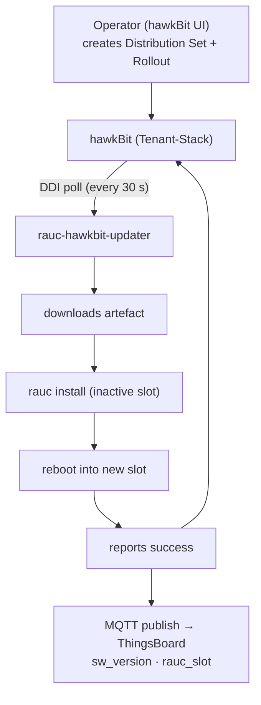
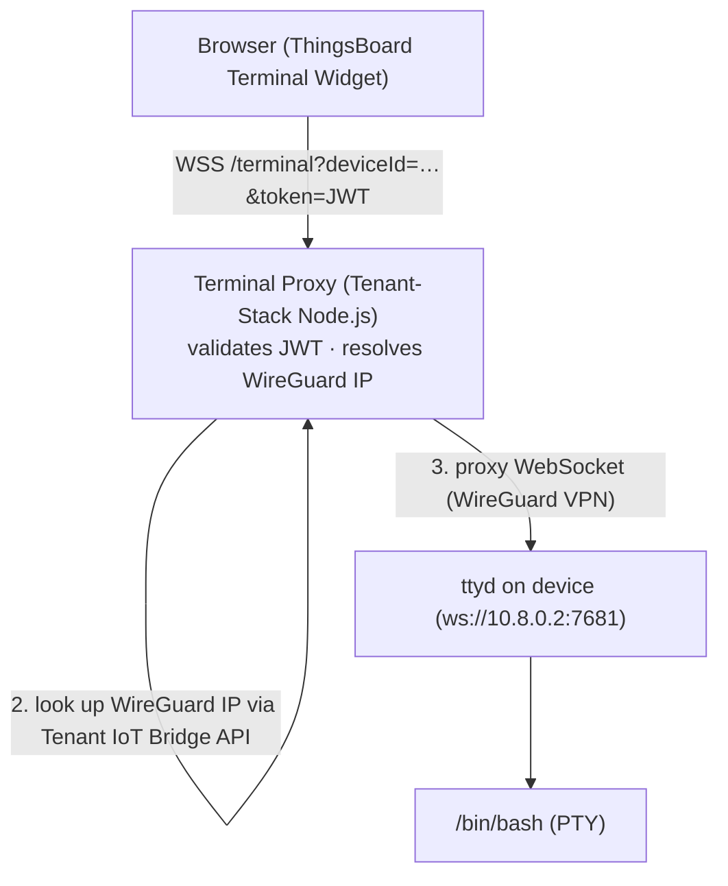
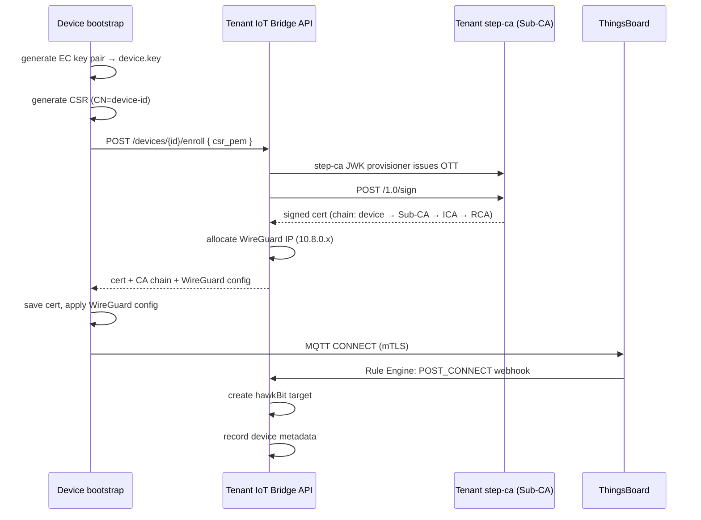
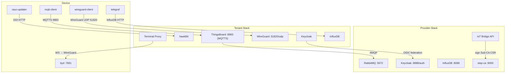

# Data Flow

This page describes how data moves through the two-stack platform for the three main flows:
telemetry, OTA updates, and remote access.

---

## 1. Telemetry Flow



**Data paths:**

- **ThingsBoard MQTT** (Tenant-Stack) handles business-logic telemetry (device state,
  alarm conditions, OTA status).  ThingsBoard’s Rule Engine can trigger actions.
- **Telegraf → Tenant InfluxDB** handles high-frequency performance metrics (every 10 s).
  This avoids overwhelming ThingsBoard’s PostgreSQL backend.
- **Tenant → Provider aggregation** (optional): ThingsBoard Rule Engine bridges selected
  metrics to the Provider RabbitMQ `cdm-metrics` vHost; Provider Telegraf consumes them
  and writes to Provider InfluxDB for platform-wide visibility.

### MQTT Message Format

ThingsBoard expects telemetry on topic `v1/devices/me/telemetry`:

```json
{
  "cpu_usage": 23.4,
  "mem_free_mb": 512,
  "sw_version": "1.0.0",
  "rauc_slot": "B",
  "ota_status": "idle"
}
```

---

## 2. OTA Update Flow



---

## 3. Remote Access Flow



---

## 4. Enrollment Flow (one-time)



---

## 5. Data Segregation

| Data Type | Transport | Storage |
|---|---|---|
| Device state, alarms, OTA status | MQTT → ThingsBoard (Tenant) | ThingsBoard PostgreSQL |
| Device telemetry (CPU, RAM, disk) | Telegraf → Tenant InfluxDB | Tenant InfluxDB |
| Platform-health metrics | AMQP → Provider RabbitMQ → Provider InfluxDB | Provider InfluxDB |
| OTA / firmware-update status | hawkBit DDI API (polled by device) | hawkBit DB |
| Audit / access logs | Keycloak events | Keycloak DB |

---

## 6. Network Diagram


