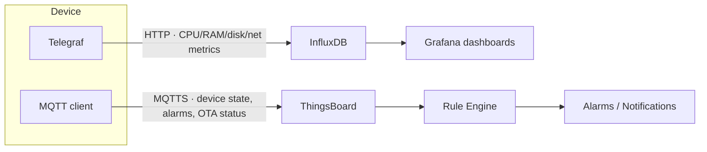
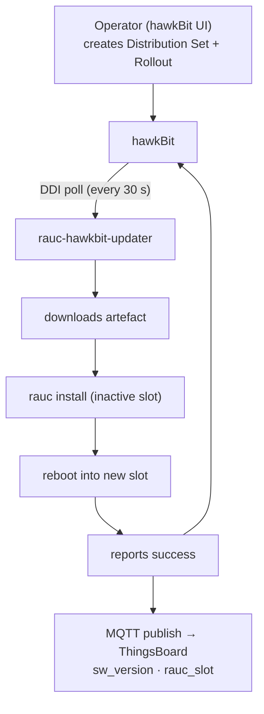
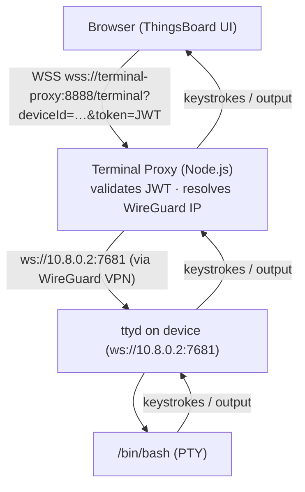
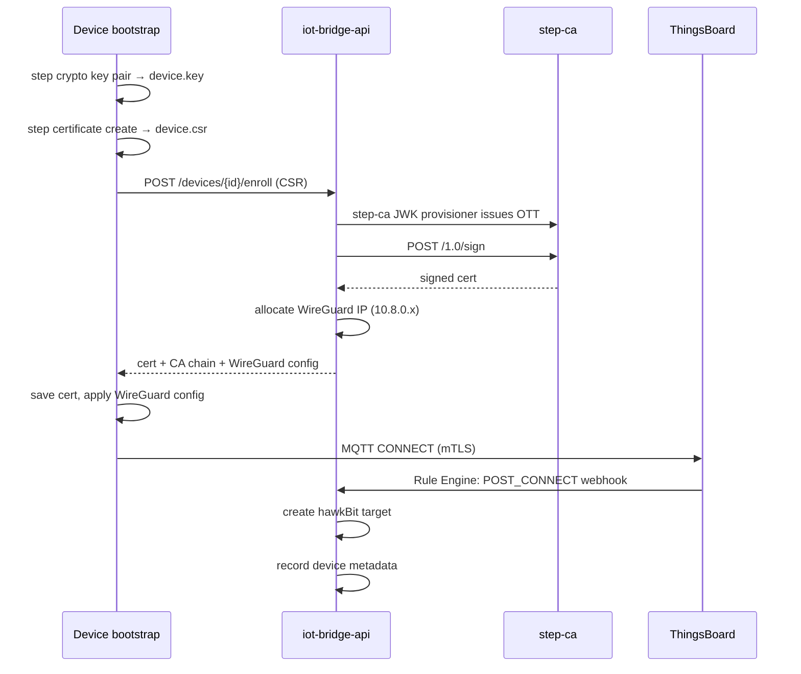
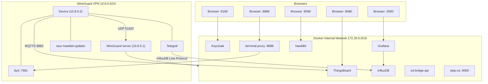

# Data Flow

This page describes how data moves through the platform for the three main flows: telemetry, OTA updates, and remote access.

---

## 1. Telemetry Flow



**Why two paths?**

- **ThingsBoard MQTT** handles business-logic telemetry (low frequency, device state changes, alarm conditions). ThingsBoard's rule engine can trigger actions based on this data.
- **Telegraf → InfluxDB** handles high-frequency performance metrics (sampled every 10 seconds or faster). This avoids overwhelming ThingsBoard's PostgreSQL backend.

### MQTT Message Format

ThingsBoard expects telemetry on topic `v1/devices/me/telemetry`:

```json
{
  "cpu_usage": 23.4,
  "mem_free_mb": 512,
  "sw_version": "1.0.0",
  "rauc_slot": "B",
  "ota_status": "idle"
}
```

---

## 2. OTA Update Flow



---

## 3. Remote Access Flow



---

## 4. Enrollment Flow (one-time)



---

## Network Diagram


