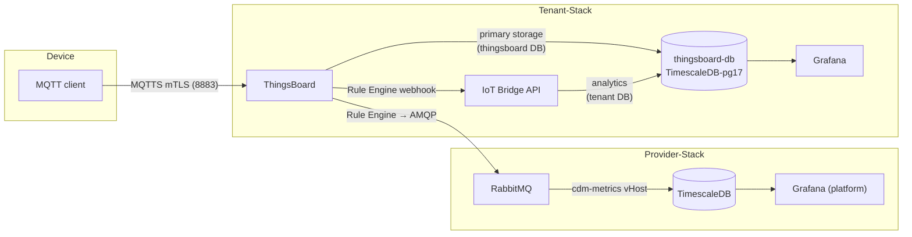
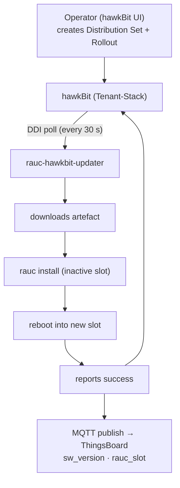
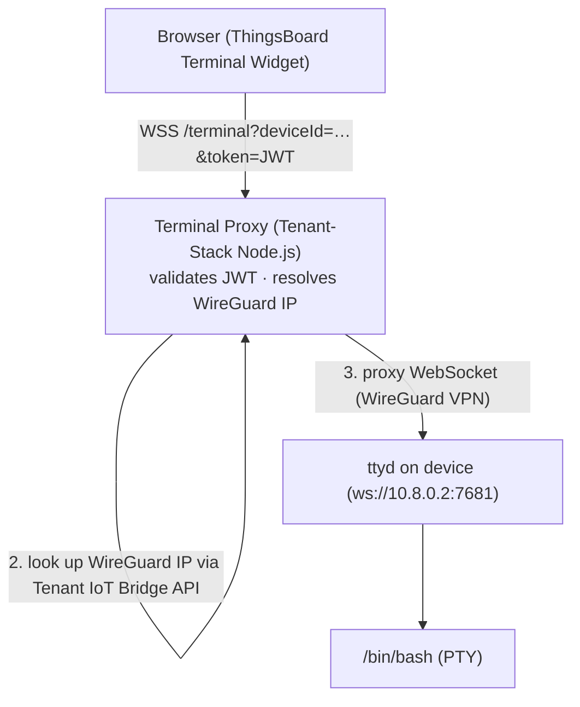
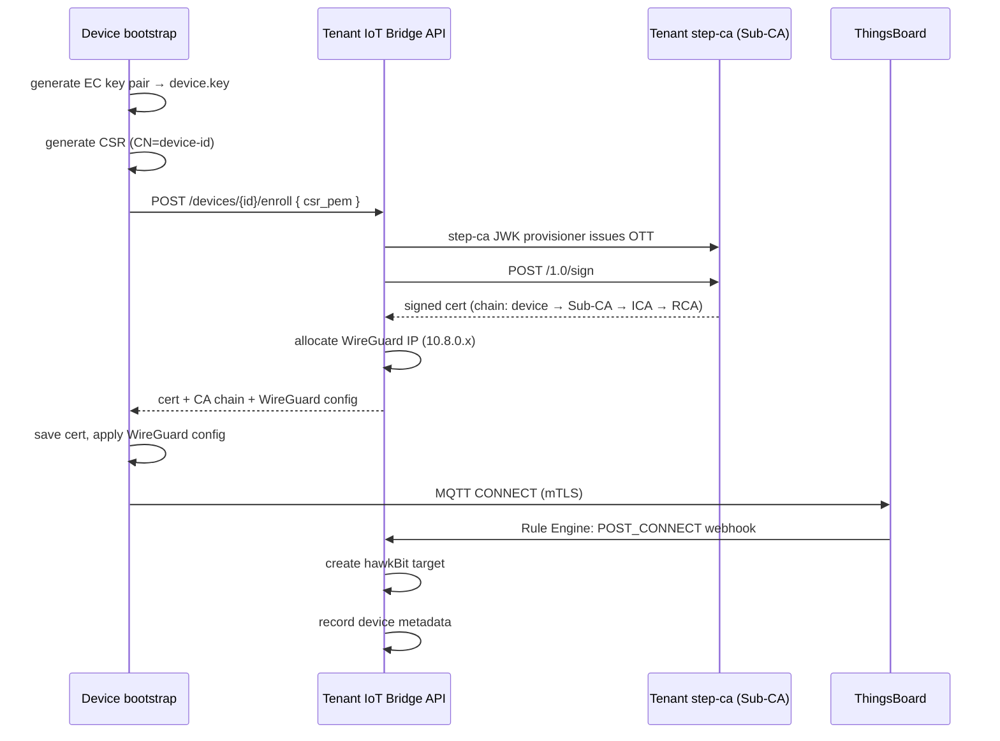
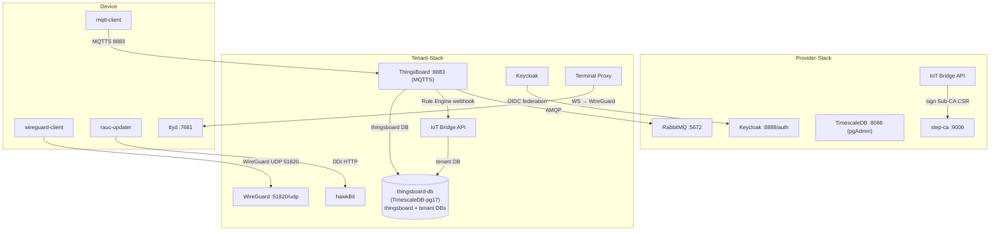

# Data Flow

This page describes how data moves through the two-stack platform for the three main flows:
telemetry, OTA updates, and remote access.

---

## 1. Telemetry Flow


```mermaid
graph LR
    subgraph device[Device]
        MQC[MQTT client]
    end

    subgraph tenant[Tenant-Stack]
        TB[ThingsBoard]
        TB_DB[(thingsboard-db\nTimescaleDB-pg17)]
        IBA[IoT Bridge API]
        GRF_T[Grafana]
        TB -->|"primary storage\n(thingsboard DB)"| TB_DB
        TB -->|"Rule Engine webhook"| IBA
        IBA -->|"analytics\n(tenant DB)"| TB_DB
        TB_DB --> GRF_T
    end

    subgraph provider[Provider-Stack]
        RMQ[RabbitMQ]
        IDB_P[(TimescaleDB)]
        GRF_P["Grafana (platform)"]
        IDB_P --> GRF_P
    end

    MQC -->|"MQTTS mTLS (8883)"| TB
    TB -->|"Rule Engine → AMQP"| RMQ
    RMQ -->|cdm-metrics vHost| IDB_P
```

**Data paths:**

- **ThingsBoard MQTT** (Tenant-Stack) receives all device telemetry (device state, alarms,
  OTA status, sensor values) over mTLS and **persists them in the `thingsboard` database**
  (primary storage). ThingsBoard's built-in dashboards and Rule Engine operate on this data.
- **Rule Engine → IoT Bridge API webhook**: ThingsBoard optionally forwards telemetry events
  via HTTP webhook to the Tenant IoT Bridge API, which writes them to a **separate `${TENANT_ID}`
  database within the same PostgreSQL instance** (TimescaleDB hypertables) for long-term
  analytics and Grafana dashboards.
- Both databases (`thingsboard` + `${TENANT_ID}`) reside in a **single `thingsboard-db`
  container** running `timescale/timescaledb:latest-pg17` — no separate TimescaleDB service.
- **Tenant → Provider aggregation** (optional): ThingsBoard Rule Engine bridges selected
  metrics to the Provider RabbitMQ `cdm-metrics` vHost; Provider TimescaleDB stores them
  for platform-wide visibility.

### MQTT Message Format

ThingsBoard expects telemetry on topic `v1/devices/me/telemetry`:

```json
{
  "cpu_usage": 23.4,
  "mem_free_mb": 512,
  "sw_version": "1.0.0",
  "rauc_slot": "B",
  "ota_status": "idle"
}
```

---

## 2. OTA Update Flow


```mermaid
graph TD
    OP["Operator (hawkBit UI)<br>creates Distribution Set + Rollout"]
    HB["hawkBit (Tenant-Stack)"]
    UPD[rauc-hawkbit-updater]
    DL[downloads artefact]
    INST["rauc install (inactive slot)"]
    REBOOT[reboot into new slot]
    RPT[reports success]
    MQTT["MQTT publish → ThingsBoard<br>sw_version · rauc_slot"]

    OP --> HB
    HB -->|"DDI poll (every 30 s)"| UPD
    UPD --> DL --> INST --> REBOOT --> RPT
    RPT --> HB
    RPT --> MQTT
```

---

## 3. Remote Access Flow


```mermaid
graph TD
    BR["Browser (ThingsBoard Terminal Widget)"]
    TXP["Terminal Proxy (Tenant-Stack Node.js)<br>validates JWT · resolves WireGuard IP"]
    TTD["ttyd on device (ws://10.8.0.2:7681)"]
    SH["/bin/bash (PTY)"]

    BR -->|"WSS /terminal?deviceId=…&token=JWT"| TXP
    TXP -->|"1. validate Keycloak JWT (JWKS from Tenant Keycloak)"| TXP
    TXP -->|"2. look up WireGuard IP via Tenant IoT Bridge API"| TXP
    TXP -->|"3. proxy WebSocket (WireGuard VPN)"| TTD
    TTD --> SH
```

---

## 4. Enrollment Flow (one-time)


```mermaid
sequenceDiagram
    participant D as Device bootstrap
    participant I as Tenant IoT Bridge API
    participant S as Tenant step-ca (Sub-CA)
    participant T as ThingsBoard

    D->>D: generate EC key pair → device.key
    D->>D: generate CSR (CN=device-id)
    D->>I: POST /devices/{id}/enroll { csr_pem }
    I->>S: step-ca JWK provisioner issues OTT
    I->>S: POST /1.0/sign
    S-->>I: signed cert (chain: device → Sub-CA → ICA → RCA)
    I->>I: allocate WireGuard IP (10.8.0.x)
    I-->>D: cert + CA chain + WireGuard config
    D->>D: save cert, apply WireGuard config
    D->>T: MQTT CONNECT (mTLS)
    T->>I: Rule Engine: POST_CONNECT webhook
    I->>I: create hawkBit target
    I->>I: record device metadata
```

---

## 5. Data Segregation

| Data Type | Transport | Storage |
|---|---|---|
| Device state, alarms, OTA status | MQTT → ThingsBoard (Tenant) | ThingsBoard PostgreSQL (`thingsboard` DB) |
| Device telemetry (CPU, RAM, disk, sensors) | MQTT → ThingsBoard (`thingsboard` DB) *(primary)*; Rule Engine webhook → IoT Bridge API → TimescaleDB (`${TENANT_ID}` DB) *(analytics)* | Single `thingsboard-db` container (two databases) |
| Platform-health metrics | AMQP → Provider RabbitMQ → Provider TimescaleDB | Provider TimescaleDB |
| OTA / firmware-update status | hawkBit DDI API (polled by device) | hawkBit DB |
| Audit / access logs | Keycloak events | Keycloak DB |

---

## 6. Network Diagram


```mermaid
graph TB
    subgraph provider["Provider-Stack"]
        RMQ_P["RabbitMQ :5672"]
        KC_P["Keycloak :8888/auth"]
        IDB_P["TimescaleDB :8086 (pgAdmin)"]
        SCA_P["step-ca :9000"]
        IBA_P["IoT Bridge API"]
    end

    subgraph tenant["Tenant-Stack"]
        TB_T["ThingsBoard :8883 (MQTTS)"]
        TB_DB[("thingsboard-db\n(TimescaleDB-pg17)\nthingsboard + tenant DBs")]
        HB_T["hawkBit"]
        KC_T["Keycloak"]
        WGS["WireGuard :51820/udp"]
        TXP["Terminal Proxy"]
        IBA_T["IoT Bridge API"]
        TB_T -->|thingsboard DB| TB_DB
        TB_T -->|Rule Engine webhook| IBA_T
        IBA_T -->|tenant DB| TB_DB
    end

    subgraph device["Device"]
        MQC[mqtt-client]
        WGC[wireguard-client]
        UPD[rauc-updater]
        TTD["ttyd :7681"]
    end

    MQC -->|MQTTS 8883| TB_T
    WGC -->|WireGuard UDP 51820| WGS
    UPD -->|DDI HTTP| HB_T
    TB_T -->|AMQP| RMQ_P
    KC_T -->|OIDC federation| KC_P
    TXP -->|WS → WireGuard| TTD
    IBA_P -->|sign Sub-CA CSR| SCA_P
```
