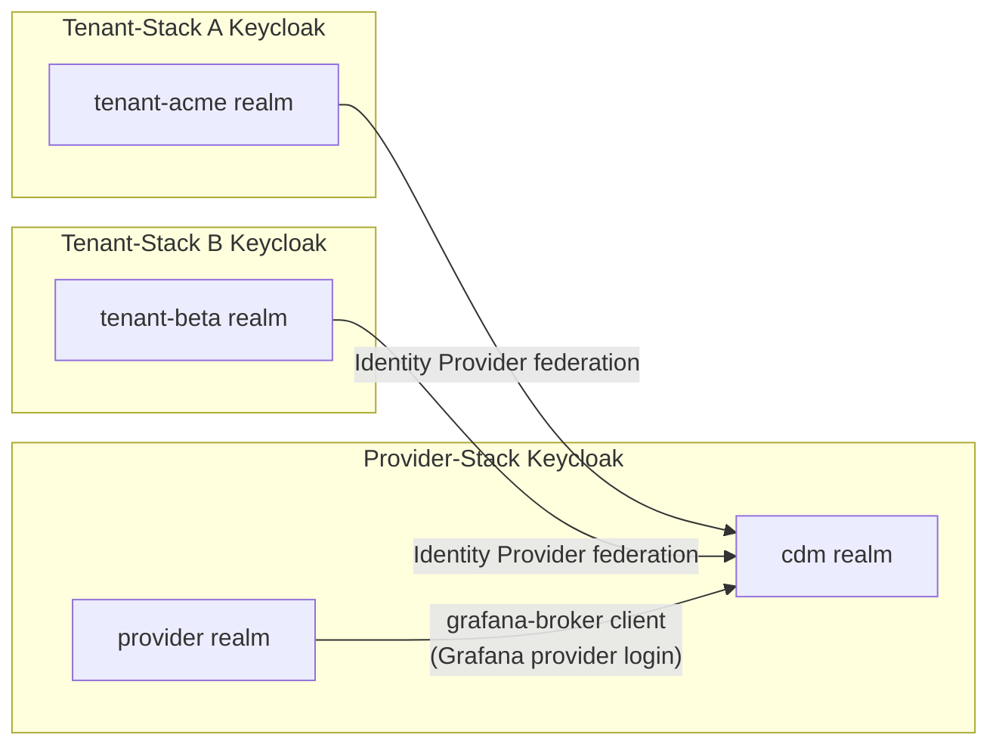

# Identity & Access Management — Keycloak

Keycloak is the identity backbone of the CDM platform.  In the two-stack architecture, two
Keycloak instances are involved: one in the **Provider-Stack** and one per **Tenant-Stack**.

---

## Realm Structure

### Provider-Stack Keycloak

Manages two realms:

| Realm | Purpose | OIDC Clients |
|---|---|---|
| `cdm` | Platform services and cross-tenant SSO | `grafana`, `iot-bridge`, `portal`, `influxdb-proxy` |
| `provider` | Platform operations staff | `grafana-broker` (Identity Provider link), `rabbitmq-management` (RabbitMQ SSO) |

**`cdm` realm roles:**

| Role | Description |
|---|---|
| `cdm-admin` | Platform administrator |
| `cdm-operator` | Fleet operator |
| `cdm-viewer` | Read-only access |

**`provider` realm roles:**

| Role | Description |
|---|---|
| `platform-admin` | Full administrative access to CDM platform and all tenants |
| `platform-operator` | Day-to-day operations; read-only on tenants |

### Tenant-Stack Keycloak *(Phase 2)*

Each tenant operates its own Keycloak instance with a single **tenant realm** that mirrors
the `cdm` realm role structure.  The tenant realm is registered as an **Identity Provider**
in the Provider `cdm` realm, enabling platform admins to access the Tenant-Stack with their
provider credentials.

| Realm | Purpose | OIDC Clients |
|---|---|---|
| `<tenant-id>` | Tenant-specific services | `thingsboard`, `hawkbit`, `grafana`, `portal`, `influxdb-proxy` |

---

## Keycloak Federation Flow



When a tenant JOIN request is approved, the IoT Bridge API automatically:
1. Registers the Tenant Keycloak realm as an OIDC **Identity Provider** in the `cdm` realm.
2. Configures role mappers so `platform-admin` maps to `cdm-admin` in the tenant realm.

---

## OIDC Client Configuration (Provider `cdm` realm)

| Client ID | Service | Type | Secret env var |
|---|---|---|---|
| `grafana` | Grafana (Provider Dashboards) | confidential | `GRAFANA_OIDC_SECRET` |
| `iot-bridge` | IoT Bridge API | confidential + service-account | `BRIDGE_OIDC_SECRET` |
| `portal` | CDM Provider Portal | confidential | `PORTAL_OIDC_SECRET` |
| `influxdb-proxy` | InfluxDB oauth2-proxy | confidential | `INFLUXDB_PROXY_OIDC_SECRET` |

All `redirectUris` and `webOrigins` are set to `*` to support dynamic Codespaces hostnames.

## OIDC Client Configuration (Provider `provider` realm)

| Client ID | Service | Type | Secret env var |
|---|---|---|---|
| `rabbitmq-management` | RabbitMQ Management UI | confidential, standard flow | `RABBITMQ_MANAGEMENT_OIDC_SECRET` |

The `rabbitmq-management` client provides five custom client scopes that map directly to
RabbitMQ permissions:

| Scope | RabbitMQ permission |
|---|---|
| `rabbitmq.tag:administrator` | Management UI admin tag |
| `rabbitmq.read:*/*` | Read all resources |
| `rabbitmq.write:*/*` | Write all resources |
| `rabbitmq.configure:*/*` | Configure all resources |
| `rabbitmq.tag:monitoring` | Read-only monitoring tag |

All four non-monitoring scopes are assigned as default scopes so that `provider` realm users
receive full administrator access to RabbitMQ on SSO login.

> **Grafana — realm-roles mapper**: The `grafana` client has an `oidc-usermodel-realm-role-mapper`
> that injects all realm roles as a flat array into the `roles` claim.  Grafana maps this to
> its internal role via `GF_AUTH_GENERIC_OAUTH_ROLE_ATTRIBUTE_PATH`.

---

## Role-Based Access

| Role | Grafana (Provider) | IoT Bridge API |
|---|---|---|
| `cdm-admin` | Admin | Full access (incl. tenant onboarding) |
| `cdm-operator` | Editor | Read + trigger deployments |
| `cdm-viewer` | Viewer | Read-only |
| `platform-admin` | Admin | Full access |
| `platform-operator` | Editor | Read-only on tenants |

---

## Updating Client Secrets

1. Log in to **http://localhost:8888/auth/admin/cdm/console/** → **Clients**.
2. For each client, go to **Credentials** → copy or regenerate the **Secret**.
3. Update `provider-stack/.env`:
   ```
   GRAFANA_OIDC_SECRET=<from Keycloak cdm realm>
   BRIDGE_OIDC_SECRET=<from Keycloak cdm realm>
   PORTAL_OIDC_SECRET=<from Keycloak cdm realm>
   INFLUXDB_PROXY_OIDC_SECRET=<from Keycloak cdm realm>
   RABBITMQ_MANAGEMENT_OIDC_SECRET=<from Keycloak provider realm → rabbitmq-management>
   ```
4. Restart affected services:
   ```bash
   cd provider-stack
   docker compose restart iot-bridge-api grafana rabbitmq keycloak
   ```

---

## Security Considerations

!!! danger "Default Admin Password"
    Change `KC_ADMIN_PASSWORD` in `provider-stack/.env` before exposing Keycloak to any network.

!!! tip "Brute-Force Protection"
    Enable Keycloak’s built-in brute-force detection: **Realm Settings → Security Defenses → Brute Force Detection**.

!!! tip "HTTPS in Production"
    Caddy handles HTTPS automatically via ACME.  Ensure `KC_HOSTNAME` in `.env` points to the
    external FQDN so Keycloak builds correct redirect URIs.
