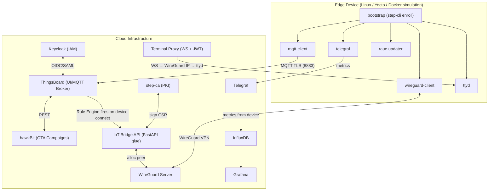
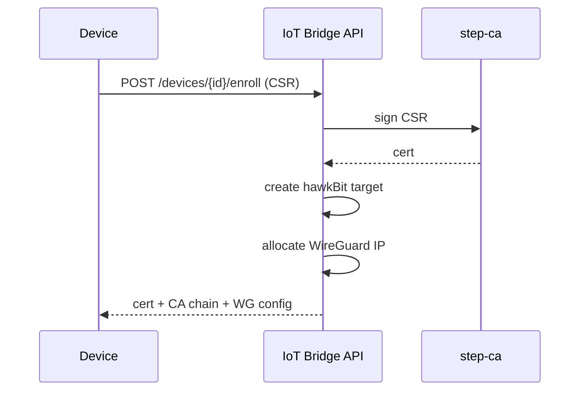
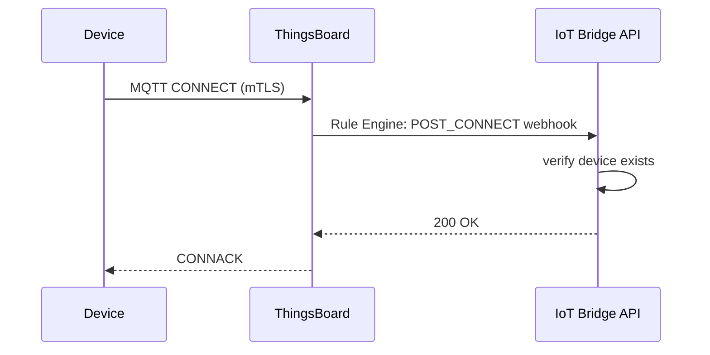
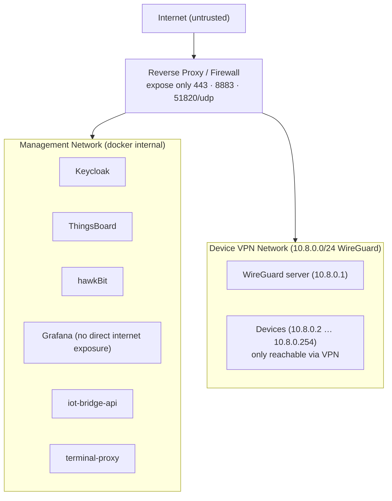

# Architecture Overview

**Complete Device Management** is built around five integration pillars:

1. **Identity & Trust** — Keycloak (SSO) + step-ca (PKI) establish who can connect and which certificates are trusted.
2. **Device Communication** — ThingsBoard provides the MQTT broker and the single-pane-of-glass UI.
3. **Software Updates** — hawkBit manages campaigns; RAUC executes them atomically on the device.
4. **Observability** — InfluxDB stores high-frequency metrics; Grafana visualises them.
5. **Remote Access** — WireGuard creates a secure overlay network; ttyd + terminal-proxy deliver a browser shell.

---

## High-Level Diagram

---

## Component Interactions

### Enrollment Flow

### MQTT Connect Flow

---

## Data Segregation

| Data Type | Transport | Storage |
|---|---|---|
| Device state, alarms, OTA status | MQTT → ThingsBoard | ThingsBoard PostgreSQL |
| High-frequency metrics (CPU/RAM/disk) | Telegraf → InfluxDB directly | InfluxDB |
| Audit / access logs | Keycloak events | Keycloak DB |

This design keeps ThingsBoard's database lean by offloading high-cardinality metric streams to InfluxDB.

---

## Security Zones

