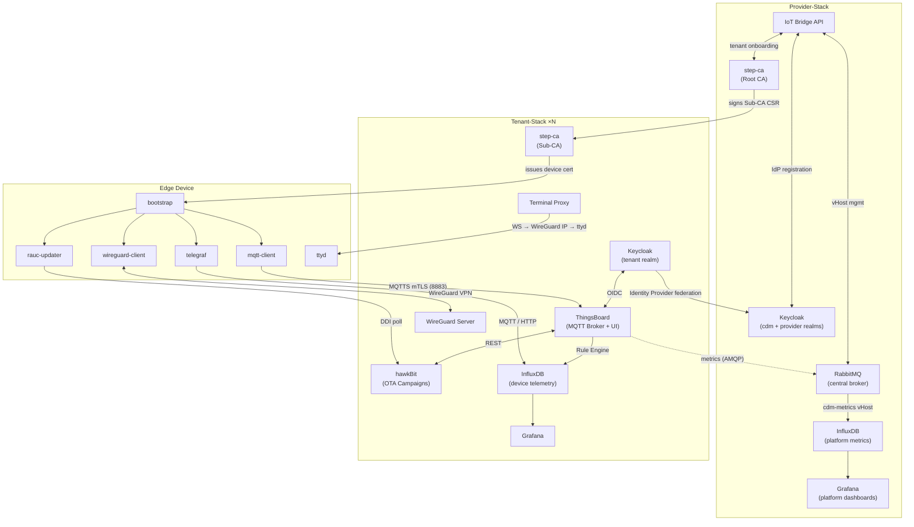
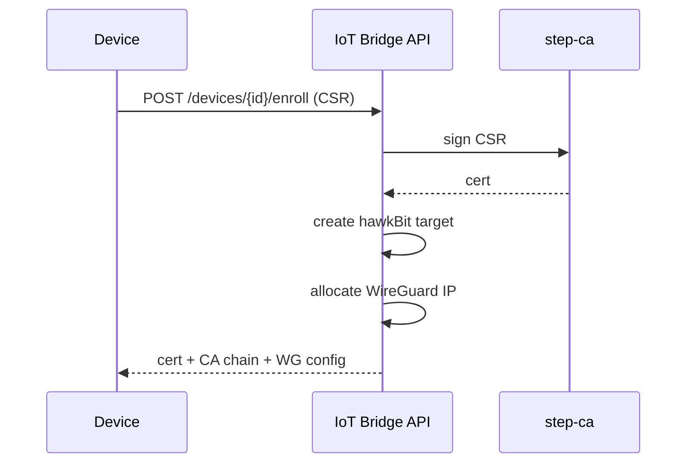
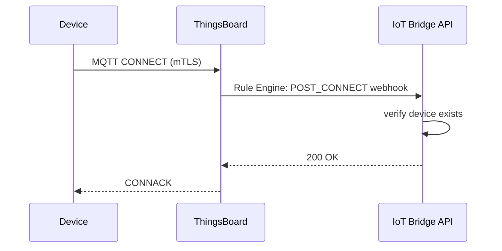
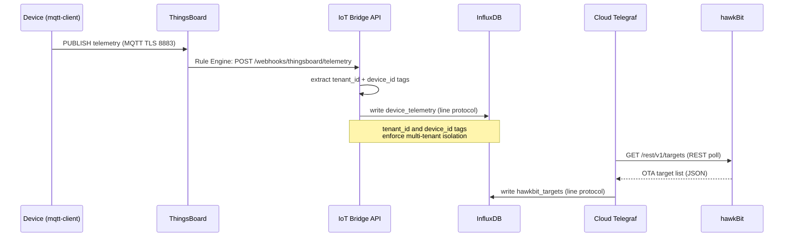
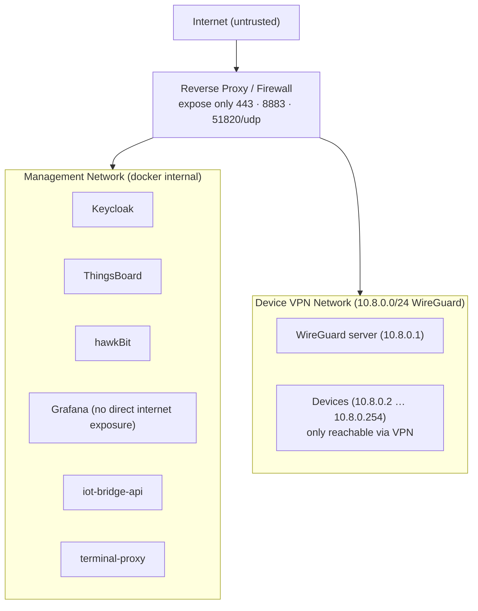

# Architecture Overview

**Complete Device Management** is built around five integration pillars:

1. **Identity & Trust** — Keycloak (SSO, realm federation) + step-ca (PKI, two-tier CA hierarchy) establish who can connect and which certificates are trusted.
2. **Device Communication** — The Tenant-Stack ThingsBoard MQTT broker receives device telemetry and state; the central Provider-Stack RabbitMQ routes data via per-tenant vHosts.
3. **Software Updates** — hawkBit (Tenant-Stack) manages campaigns; RAUC executes them atomically on the device.
4. **Observability** — Device telemetry flows into the Tenant-Stack InfluxDB; platform-health metrics flow via RabbitMQ into the Provider-Stack InfluxDB.  Grafana is deployed in both stacks.
5. **Remote Access** — WireGuard (Tenant-Stack) creates a secure overlay network; ttyd + terminal-proxy deliver a browser shell.

For a complete picture of how the two stacks relate, see [Architecture → Stack Topology](stack-topology.md).

---

## High-Level Diagram

---

## Component Interactions

### Enrollment Flow

### MQTT Connect Flow

### Device Metrics Flow

---

## Data Segregation

| Data Type | Transport | Storage |
|---|---|---|
| Device state, alarms, OTA status | MQTT → ThingsBoard | ThingsBoard PostgreSQL |
| Device telemetry (CPU, RAM, disk, etc.) | MQTT → ThingsBoard Rule Engine → iot-bridge-api webhook → InfluxDB | InfluxDB |
| OTA / firmware-update status | Cloud Telegraf polls hawkBit REST API | InfluxDB |
| Optional sensor data | MQTT (`cdm/<tenant>/<device>/sensors`) → Telegraf → InfluxDB | InfluxDB |
| Audit / access logs | Keycloak events | Keycloak DB |

This design keeps ThingsBoard's database lean by offloading high-cardinality metric streams to InfluxDB. The three metric paths are:

- **Device telemetry**: ThingsBoard Rule Engine fires a webhook to the IoT Bridge API, which writes `device_telemetry` measurements tagged with `tenant_id` and `device_id` to enforce multi-tenant isolation.
- **OTA status**: Cloud Telegraf polls the hawkBit Management REST API and writes `hawkbit_targets` measurements to InfluxDB, giving operations teams a consolidated firmware rollout view.
- **Optional sensor data**: Devices may publish additional readings to the MQTT topic `cdm/<tenant>/<device>/sensors`; device-side or cloud-side Telegraf subscribes and writes them directly to InfluxDB.

---

## Security Zones

