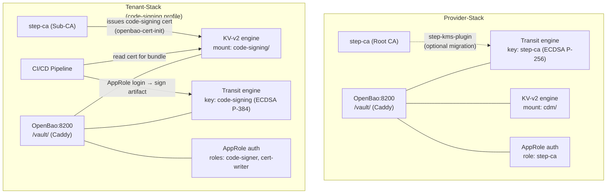

# Key Management — OpenBao

[OpenBao](https://openbao.org/) is an open-source, community-maintained fork of
HashiCorp Vault.  The CDM platform uses it in two roles:

| Stack | Role | Profile / Status |
|---|---|---|
| **Provider-Stack** | Transit engine (step-ca key ops) + KV-v2 platform secrets | Always on |
| **Tenant-Stack** | Code-signing vault for OTA bundles (RAUC) | Optional (`code-signing` profile) |

---

## Architecture



---

## Provider-Stack OpenBao

### Services

| Container | Image | Purpose |
|---|---|---|
| `provider-openbao` | custom (openbao + jq) | OpenBao server with auto-init/unseal |

### First Boot

On the first container start the entrypoint automatically:

1. Initialises OpenBao with 1 key share / threshold 1.
2. Stores the root token and unseal key in `/openbao/data/.init.json` (volume-backed).
3. Unseals the server.
4. Enables the **Transit secrets engine** and creates a key `step-ca` (ECDSA P-256).
5. Enables the **KV-v2 secrets engine** at the mount path `cdm/`.
6. Enables **AppRole** auth and creates a role `step-ca` bound to the `step-ca` policy.
7. Prints the AppRole `role-id` and `secret-id` to the container log.

Retrieve the generated credentials:

```bash
# Print the AppRole credentials for step-ca
docker logs provider-openbao 2>&1 | grep -A3 "AppRole credentials"

# Or read directly from the init file
docker compose exec openbao jq '{role_id: "see log", root_token: .root_token}' \
  /openbao/data/.init.json
```

Add `OPENBAO_STEP_CA_ROLE_ID` and `OPENBAO_STEP_CA_SECRET_ID` to `provider-stack/.env`.

### Accessing the UI

The OpenBao web UI is available at `/vault/` (via Caddy) and on port `8200` directly:

| Method | URL |
|---|---|
| Via Caddy | `http://localhost:8888/vault/ui` |
| Direct | `http://localhost:8200/ui` |

Login with the **Root Token** displayed in the container log or from `.init.json` (setup only;
rotate afterwards using the Token Auth method).

### step-ca Key Migration (optional)

In a default installation, the step-ca Root CA private key is stored encrypted in the
`step-ca-data` Docker volume.  For higher-security deployments the key can be migrated to
OpenBao using the [step-kms-plugin](https://github.com/smallstep/step-kms-plugin).

!!! info "Migration is optional"
    The Transit engine is pre-configured and ready to use.  Key migration requires
    rebuilding the step-ca image and re-initialising the CA — plan this for new deployments,
    not existing ones.

**Step 1 – Install the step-kms-plugin in the step-ca image:**

Add to `provider-stack/step-ca/Dockerfile`:

```dockerfile
# Install step-kms-plugin for HashiVault/OpenBao key storage
RUN STEPKMS_VERSION="0.13.3" && \
    curl -Lo /tmp/step-kms-plugin.tar.gz \
      "https://github.com/smallstep/step-kms-plugin/releases/download/v${STEPKMS_VERSION}/step-kms-plugin_${STEPKMS_VERSION}_linux_amd64.tar.gz" && \
    tar xzf /tmp/step-kms-plugin.tar.gz -C /usr/local/bin step-kms-plugin && \
    chmod +x /usr/local/bin/step-kms-plugin && \
    rm /tmp/step-kms-plugin.tar.gz
```

**Step 2 – Set env vars in `provider-stack/.env`:**

```ini
VAULT_ADDR=http://openbao:8200
VAULT_TOKEN=<root-token-or-approle-token>
```

**Step 3 – Generate the Root CA key in OpenBao Transit:**

```bash
# Create an RSA-4096 key in Transit for the Root CA
docker exec provider-openbao \
  bao write transit/keys/step-ca-root \
    type=rsa-4096 exportable=false
```

**Step 4 – Re-initialise step-ca with the KMS URI:**

When initialising a fresh step-ca deployment, pass the KMS URI via:

```bash
step ca init \
  --name "CDM Root CA" \
  --kms "uri=hashivault://step-ca-root;token=${VAULT_TOKEN};addr=http://openbao:8200" \
  ...
```

The step-ca Root CA private key will then live exclusively in OpenBao Transit.

---

## Tenant-Stack OpenBao (Code-Signing)

### Activating the code-signing profile

```bash
cd tenant-stack

# Activate by adding COMPOSE_PROFILES=code-signing to .env
echo "COMPOSE_PROFILES=code-signing" >> .env

# Or pass it inline
docker compose --profile code-signing up -d
```

### Services

| Container | Image | Purpose |
|---|---|---|
| `<tenant>-openbao` | custom (openbao + jq) | OpenBao server with auto-init/unseal |
| `<tenant>-openbao-cert-init` | `smallstep/step-cli:latest` | Requests code-signing cert from step-ca; stores it in KV-v2 |

### First Boot Sequence

```
docker compose --profile code-signing up -d
```

1. `step-ca` starts (Tenant Sub-CA, must be healthy).
2. `openbao` starts:
   - Initialises, unseals, creates Transit key `code-signing` (ECDSA P-384).
   - Creates KV-v2 mount `code-signing/`.
   - Creates AppRoles `code-signer` and `cert-writer`.
   - Writes `cert-writer` credentials to the `openbao-creds` shared volume.
3. `openbao-cert-init` runs:
   - Adds the `code-signer` JWK provisioner to the Tenant step-ca (idempotent).
   - Generates a local ECDSA P-384 key pair.
   - Requests a certificate with `codeSigning` EKU from the Tenant step-ca.
   - Authenticates to OpenBao with the `cert-writer` AppRole.
   - Stores `cert`, `key`, and `ca_chain` at KV path `code-signing/data/cert`.
   - Removes the private key from disk.

### Accessing the UI

| Method | URL (default port offset +10000) |
|---|---|
| Via Caddy | `http://localhost:18888/vault/ui` |
| Direct | `http://localhost:18200/ui` |

### Signing OTA Bundles

**Retrieve the code-signing certificate:**

```bash
OPENBAO_ADDR=http://localhost:18200
VAULT_TOKEN=<root-token-or-code-signer-approle-token>

# Get the certificate (PEM)
curl -sH "X-Vault-Token: $VAULT_TOKEN" \
  "${OPENBAO_ADDR}/v1/code-signing/data/cert" \
  | jq -r '.data.data.cert' > rauc-signing.crt

# Get the CA chain
curl -sH "X-Vault-Token: $VAULT_TOKEN" \
  "${OPENBAO_ADDR}/v1/code-signing/data/cert" \
  | jq -r '.data.data.ca_chain' > ca-chain.crt
```

**Sign a bundle hash via Transit (CI/CD pipeline):**

```bash
# Base64-encode the artifact hash (plaintext input must be base64)
HASH_B64=$(sha256sum cdm-os-1.1.0.tar.gz | awk '{print $1}' | xxd -r -p | base64)

# Request signing via the Transit API
SIGNATURE=$(curl -s \
  --request POST \
  --header "X-Vault-Token: $VAULT_TOKEN" \
  --data "{\"input\":\"${HASH_B64}\",\"hash_algorithm\":\"sha2-256\"}" \
  "${OPENBAO_ADDR}/v1/transit/sign/code-signing" \
  | jq -r '.data.signature')

echo "Vault signature: $SIGNATURE"
```

**RAUC bundle signing (traditional key extraction):**

For RAUC, the signing key must be accessible as a PEM file.  Retrieve it **once** in a
trusted environment:

```bash
# Retrieve the private key from OpenBao KV (only allowed with the root token
# or a specially scoped policy; rotate after extraction)
curl -sH "X-Vault-Token: $VAULT_TOKEN" \
  "${OPENBAO_ADDR}/v1/code-signing/data/cert" \
  | jq -r '.data.data.key' > rauc-signing.key

# Sign the RAUC bundle
rauc bundle \
  --cert rauc-signing.crt \
  --key  rauc-signing.key \
  --keyring ca-chain.crt \
  rootfs-image.tar \
  cdm-os-1.1.0.raucb

# Shred the local key copy after signing
shred -u rauc-signing.key
```

!!! warning "Private key handling"
    Even though OpenBao protects the key at rest, short-term extraction for RAUC signing is
    acceptable when performed in an ephemeral, controlled CI/CD environment.
    After signing, delete the local key file (`shred -u rauc-signing.key`).
    For zero-extraction signing, integrate RAUC's CMS signing step with OpenBao's Transit
    API via a custom signing hook.

---

## Security Notes

!!! danger "Auto-unseal key in data volume"
    The default setup stores the unseal key and root token in `/openbao/data/.init.json`.
    Secure the Docker volume accordingly.  In production, consider:

    - **Cloud KMS auto-unseal** (AWS KMS, Azure Key Vault, GCP CKMS) — removes the
      plaintext unseal key from the container.
    - **Multiple key shares** (`-key-shares=5 -key-threshold=3`) — require physical
      quorum to unseal.
    - **Root token rotation** — generate a new root token and revoke the initial one.

!!! tip "AppRole token rotation"
    `OPENBAO_STEP_CA_SECRET_ID` (Provider) and `OPENBAO_CODESIGN_SECRET_ID` (Tenant) should
    be rotated periodically.  Generate a new secret-id via the OpenBao UI or API and update
    the `.env` file:

    ```bash
    bao write -format=json -f auth/approle/role/step-ca/secret-id \
      | jq -r .data.secret_id
    ```

!!! tip "Audit logging"
    Enable the OpenBao file audit log to record all key access events:

    ```bash
    bao audit enable file file_path=/openbao/data/audit.log
    ```

---

## Production Hub-and-Spoke Setup

For production deployments the embedded single-node OpenBao instance is replaced by an
**OpenBao Agent** that proxies all requests to a central, hardware-secured Hub cluster.
Switch mode by setting `OPENBAO_MODE=agent` in the stack's `.env`.

### When to use which mode

| Mode | When |
|---|---|
| `embedded` (default) | Local development, CI, single-instance deployments |
| `agent` | Production; multiple stacks sharing one Root of Trust; compliance requirements |

### Quick setup

1. **Configure the Hub** — follow the [Hub-and-Spoke Architecture guide](../security/hsm-agent-model.md#5-hub-setup-initial-approle-configuration) to initialise engines, policies, and AppRoles.
2. **Copy the example env:**
   ```bash
   cp provider-stack/openbao/.env.ha-example provider-stack/.env
   # fill in OPENBAO_HUB_ADDR and the two AppRole credentials
   ```
3. **Restart the stack:**
   ```bash
   docker compose restart openbao
   ```
4. **Verify:** `docker compose exec openbao bao status` should show `Sealed: false` and `HA Enabled: true` (from the Hub).

### Migration checklist: embedded → agent

- [ ] Export existing KV secrets from the embedded instance (`bao kv get` / UI export).
- [ ] Re-create secrets on the Hub under the same paths.
- [ ] Note: Transit keys with `exportable=false` cannot be migrated — create new keys on the Hub and re-sign any artefacts (certificates, OTA bundles).
- [ ] Set `OPENBAO_MODE=agent` and Hub credentials in `.env`.
- [ ] `docker compose restart openbao`.
- [ ] Confirm downstream services (`step-ca`, CI/CD) can still reach `http://openbao:8200`.

See [Key Store: Hub-and-Spoke Architecture](../security/hsm-agent-model.md) for the full
production guide and [HA & Disaster Recovery](../security/hsm-disaster-recovery.md) for
the Hub cluster specification.
