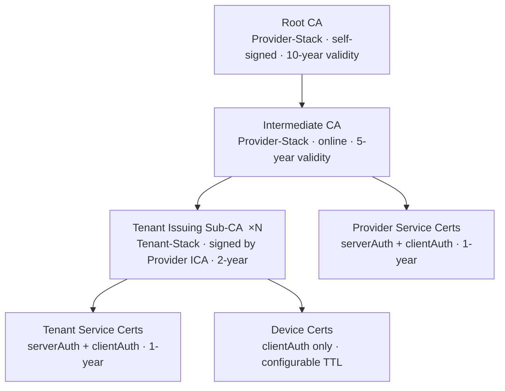
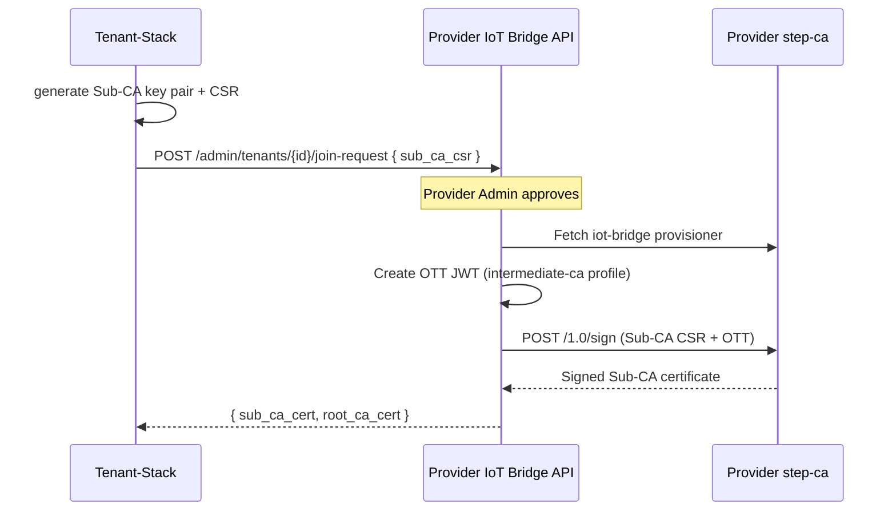
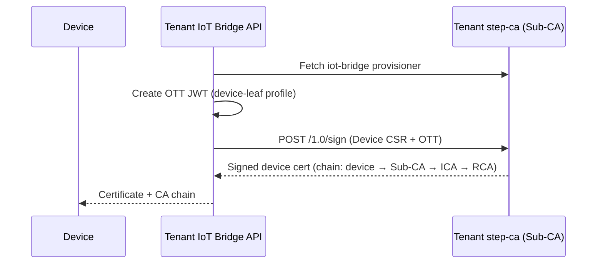

# PKI — smallstep step-ca

The platform uses [smallstep step-ca](https://smallstep.com/docs/step-ca/) as its private
Certificate Authority.  The PKI is split across two stacks to isolate trust anchors from
operational CAs.

---

## Trust Hierarchy



**Provider-Stack step-ca** is the trust anchor for the entire platform:
- Hosts the Root CA and Intermediate CA.
- Signs Tenant Sub-CA CSRs during the JOIN workflow.
- Issues service certificates for Provider-Stack services.

**Tenant-Stack step-ca** is an Issuing Sub-CA per tenant:
- Private key generated locally on the Tenant-Stack (never leaves the tenant).
- Certificate signed by the Provider Intermediate CA via the JOIN workflow.
- Issues device certificates and tenant service certificates.
- Devices trust the full chain: device → Sub-CA → ICA → Root CA.

The Root CA private key is encrypted with `STEP_CA_PASSWORD` and stored in the
`step-ca-data` Docker volume.  In production, move the Root CA key offline after
generating the Intermediate CA.

---

## Provisioners

Two provisioners are configured in the **Provider-Stack** step-ca:

| Name | Type | Purpose |
|---|---|---|
| `iot-bridge` | JWK (JSON Web Key) | Signs Tenant Sub-CA CSRs and (via Tenant step-ca) device CSRs programmatically |
| `acme` | ACME | Auto-renews TLS certificates for Provider-Stack services via Caddy |

Each **Tenant-Stack** step-ca also has an `iot-bridge` JWK provisioner for signing device CSRs.

### Sub-CA Signing Flow (JOIN Workflow — Provider-Stack)



### Device Leaf Signing Flow (Tenant-Stack)



---

## Certificate Templates

### Device Leaf (`templates/device-leaf.tpl`)

- Key Usage: `digitalSignature`
- Extended Key Usage: `clientAuth` only (devices cannot act as servers)
- Subject: `CN=<device_id>`
- SAN: `<device_id>` (DNS)
- No CA flag

### Service Leaf (`templates/service-leaf.tpl`)

- Key Usage: `digitalSignature`, `keyEncipherment`
- Extended Key Usage: `serverAuth` + `clientAuth`
- Subject: `CN=<service_name>`
- SAN: configurable DNS names + IPs

---

## Operational Procedures

### Retrieve the Root CA Fingerprint (Provider-Stack)

```bash
cd provider-stack

# Print fingerprint (needed by Tenant-Stacks and devices)
docker compose exec step-ca step ca fingerprint

# Export PEM
docker compose exec step-ca step ca root /tmp/root_ca.crt
docker compose cp step-ca:/tmp/root_ca.crt ./root_ca.crt
```

Set the fingerprint as `STEP_CA_FINGERPRINT` in every Tenant-Stack and Device-Stack `.env`.

### Inspect a Device Certificate

```bash
step certificate inspect device.crt
```

### Revoke a Device Certificate (Tenant-Stack)

Device certs are issued by the Tenant Sub-CA.  Revoke at tenant level first:

```bash
step ca revoke --cert device.crt --key device.key \
  --ca-url https://<tenant-step-ca>:9000 \
  --root root_ca.crt
```

For escalation (Sub-CA compromise), revoke the entire Sub-CA at the Provider level:

```bash
cd provider-stack
step ca revoke <sub-ca-serial> \
  --ca-url https://localhost:9000 \
  --root root_ca.crt
```

---

## Security Considerations

!!! warning "Root CA Key"
    In production, after generating the Intermediate CA, export the Root CA private key from
    the container, store it offline (HSM or air-gapped vault), and remove it from the
    `step-ca-data` volume.  Only the Intermediate CA needs to be online.

!!! tip "Certificate Validity"
    Keep device certificate validity short (hours to days) and rely on automatic renewal.
    Short-lived certs are more resilient to key compromise than long-lived ones.

!!! tip "Sub-CA Independence"
    Each Tenant-Stack Sub-CA can be independently rotated by generating a new CSR and going
    through the JOIN signing flow again — without affecting other tenants or the Provider-Stack.
