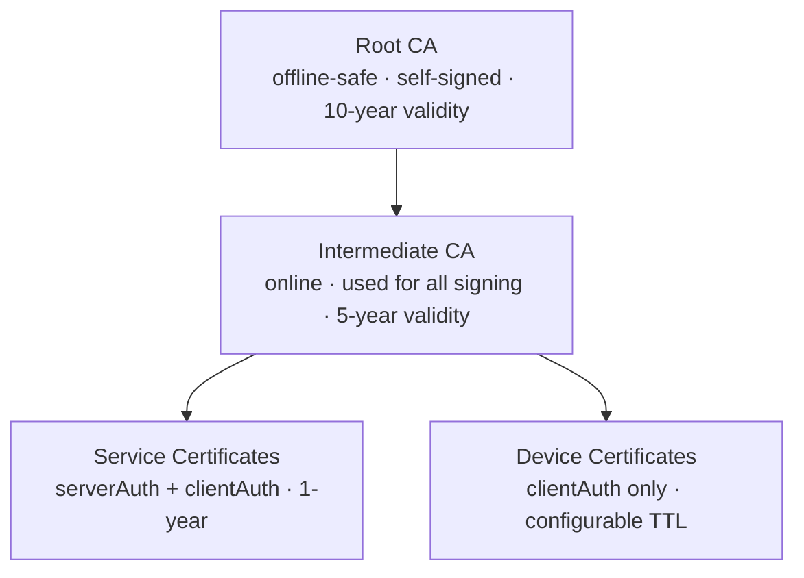
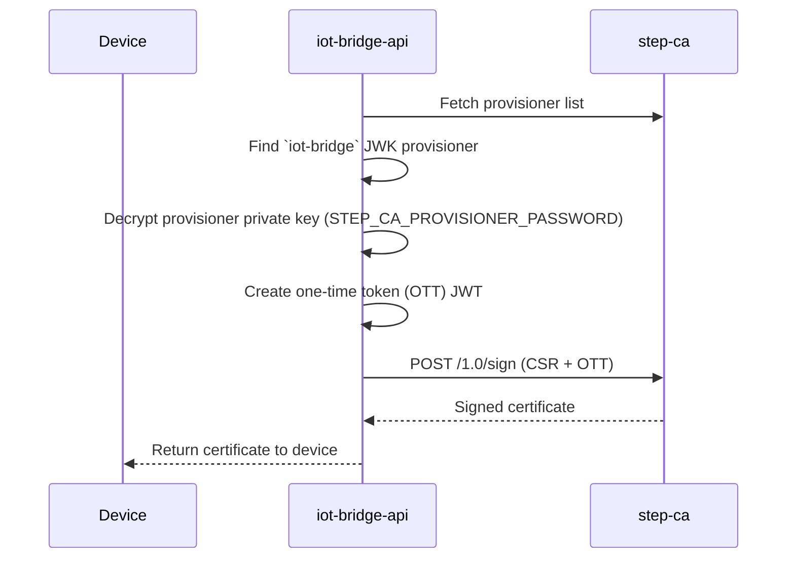

# PKI — smallstep step-ca

The platform uses [smallstep step-ca](https://smallstep.com/docs/step-ca/) as its private Certificate Authority. This page describes the trust hierarchy, certificate profiles, and operational procedures.

---

## Trust Hierarchy



The Root CA private key is encrypted with `STEP_CA_PASSWORD` and stored in the `step-ca-data` Docker volume. In production, move the Root CA key offline after generating the Intermediate CA.

---

## Provisioners

Two provisioners are configured out of the box:

| Name | Type | Purpose |
|---|---|---|
| `iot-bridge` | JWK (JSON Web Key) | Used by `iot-bridge-api` to sign device CSRs programmatically |
| `acme` | ACME | Used by internal services to auto-renew TLS certificates via the ACME protocol |

### JWK Provisioner Flow



---

## Certificate Templates

### Device Leaf (`templates/device-leaf.tpl`)

- Key Usage: `digitalSignature`
- Extended Key Usage: `clientAuth` only (devices cannot act as servers)
- Subject: `CN=<device_id>`
- SAN: `<device_id>` (DNS)
- No CA flag

### Service Leaf (`templates/service-leaf.tpl`)

- Key Usage: `digitalSignature`, `keyEncipherment`
- Extended Key Usage: `serverAuth` + `clientAuth`
- Subject: `CN=<service_name>`
- SAN: configurable DNS names + IPs

---

## Operational Procedures

### Retrieve the Root CA Certificate

```bash
# From the running container
docker compose exec step-ca step ca root

# Save to file
docker compose exec step-ca step ca root /tmp/root_ca.crt
docker compose cp step-ca:/tmp/root_ca.crt ./root_ca.crt
```

### Retrieve the CA Fingerprint

```bash
step certificate fingerprint root_ca.crt
```

Set this value as `STEP_CA_FINGERPRINT` in both `.env` files.

### Inspect a Device Certificate

```bash
step certificate inspect device.crt
```

### Revoke a Device Certificate

```bash
step ca revoke --cert device.crt --key device.key \
  --ca-url https://localhost:9000 --root root_ca.crt
```

After revocation, the certificate will be rejected at the next MQTT reconnect (ThingsBoard validates against the CRL/OCSP endpoint).

### Rotate the Intermediate CA

```bash
# Generate a new intermediate key and CSR
step certificate create "CDM Intermediate CA 2" intermediate2.csr intermediate2.key \
  --ca root_ca.crt --ca-key root_ca.key --profile intermediate-ca --no-password --insecure

# Sign with Root CA
step certificate sign intermediate2.csr root_ca.crt root_ca.key

# Replace in step-ca — see smallstep docs for hot rotation
```

---

## Security Considerations

!!! warning "Root CA Key"
    In production, after generating the Intermediate CA, export the Root CA private key from the container, store it offline (HSM or air-gapped vault), and remove it from the `step-ca-data` volume. Only the Intermediate CA needs to be online.

!!! tip "Certificate Validity"
    Keep device certificate validity short (hours to days) and rely on automatic renewal. Short-lived certs are more resilient to key compromise than long-lived ones.
