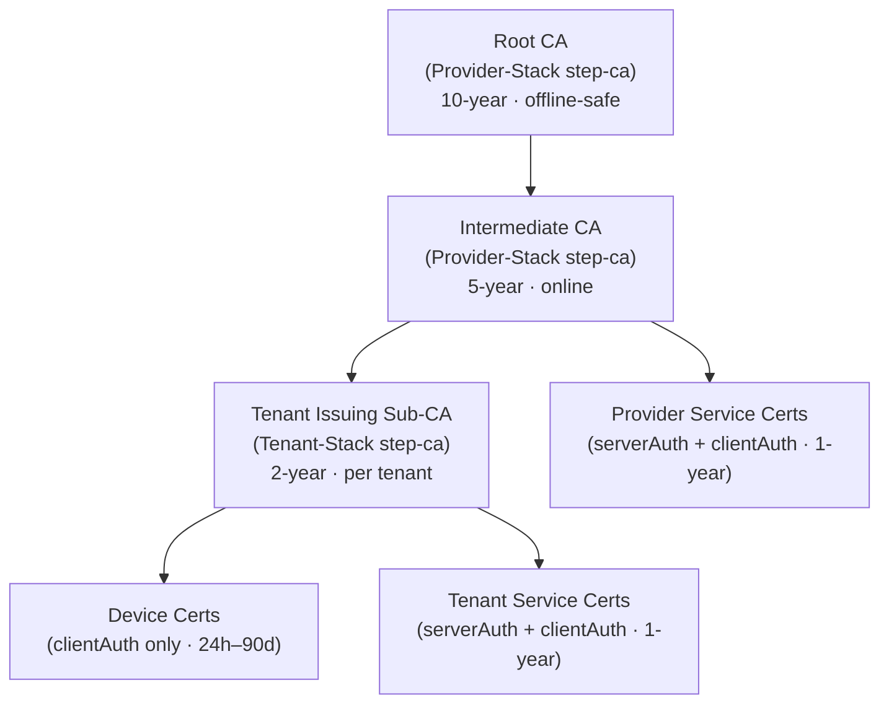
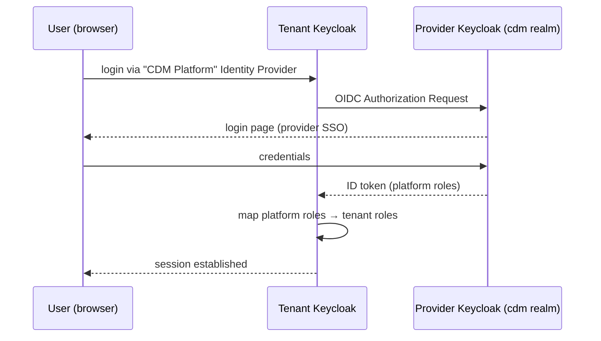
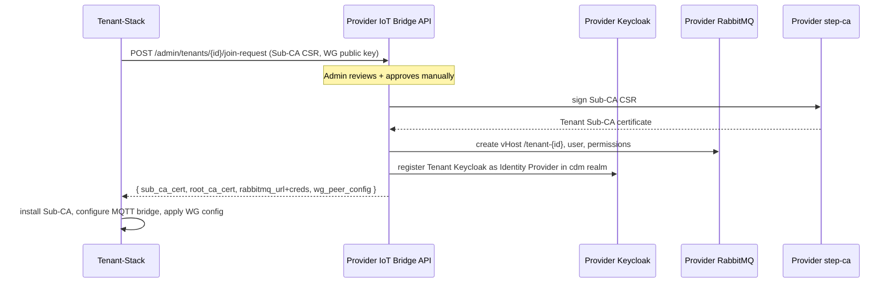

# Stack Topology

This page describes the two-stack architecture of the Complete Device Management platform,
the network boundaries between stacks, the trust relationships, and all communication paths.

---

## Overview Diagram

```mermaid
graph TB
    subgraph provider["Provider-Stack  (CDM operator)"]
        CADDY_P["Caddy :8888 (entry point)"]
        KC_P["Keycloak\n(realms: cdm, provider)"]
        RMQ["RabbitMQ\n(vHost per tenant)"]
        IDB_P["InfluxDB\n(provider metrics)"]
        GRF_P["Grafana\n(platform dashboards)"]
        SCA_P["step-ca\n(Root CA + Intermediate CA)"]
        IBA["IoT Bridge API\n(management API)"]
    end

    subgraph tenant["Tenant-Stack  (customer)  ×N"]
        CADDY_T["Caddy :8888 (entry point)"]
        KC_T["Keycloak\n(tenant realm)"]
        TB["ThingsBoard\n(device mgmt + MQTT)"]
        HB["hawkBit\n(OTA campaigns)"]
        SCA_T["step-ca\n(Issuing Sub-CA)"]
        WGS["WireGuard Server"]
        TXP["Terminal Proxy"]
        IDB_T["InfluxDB\n(device telemetry)"]
        GRF_T["Grafana\n(tenant dashboards)"]
    end

    subgraph device["Device-Stack  (edge)"]
        BST["bootstrap\n(enroll.sh)"]
        MQC["mqtt-client"]
        WGC["wireguard-client"]
        TLG["telegraf"]
        UPD["rauc-updater"]
        TTD["ttyd"]
    end

    %% PKI trust chain
    SCA_P -->|"signs Sub-CA CSR"| SCA_T
    SCA_T -->|"issues device cert"| BST

    %% Keycloak federation
    KC_T -->|"Identity Provider federation"| KC_P

    %% Tenant JOIN
    IBA -->|"creates vHost + user,\nsigns Sub-CA CSR,\nregisters IdP"| tenant

    %% Device → Tenant-Stack
    MQC -->|"MQTTS mTLS"| TB
    WGC -->|"WireGuard VPN"| WGS
    UPD -->|"DDI poll"| HB
    TLG -->|"InfluxDB line protocol"| IDB_T

    %% Tenant → Provider
    TB -->|"metrics (AMQP)"| RMQ
    IDB_T -.->|"aggregated metrics"| IDB_P

    %% Terminal
    TXP -->|"WS → WireGuard IP → ttyd"| TTD
```

---

## Network Boundaries

| Boundary | Protocol | Authentication |
|---|---|---|
| Provider-Stack ingress | HTTPS (Caddy ACME) | Keycloak OIDC |
| Tenant-Stack ingress | HTTPS (Caddy ACME) | Keycloak OIDC (tenant realm) |
| Device → Tenant MQTT | MQTTS (port 8883) | mTLS (device cert signed by Tenant Sub-CA) |
| Tenant-Stack → Provider RabbitMQ | AMQPS (port 5671) | mTLS (service cert signed by Provider CA) |
| Tenant Keycloak → Provider Keycloak | HTTPS | OIDC Identity Provider federation |
| Device → WireGuard | WireGuard UDP (51820) | Pre-shared key provisioned at enrollment |
| Browser → Terminal Proxy | WSS | Keycloak JWT (`cdm-operator` / `cdm-admin`) |

---

## Trust Hierarchy

The Root CA private key is stored in the `step-ca-data` Docker volume, encrypted with
`STEP_CA_PASSWORD`.  In production, export it and store it offline after generating the
Intermediate CA.

Each Tenant-Stack generates its own Sub-CA key pair and sends a CSR to the Provider IoT
Bridge API via the JOIN workflow.  The Provider Intermediate CA signs the CSR, establishing
a chain of trust from device → Tenant Sub-CA → Provider Intermediate CA → Provider Root CA.

---

## Keycloak Identity Federation

Platform administrators and operators from the Provider-Stack automatically receive
scoped access to every Tenant-Stack through this federation — without separate credentials.

---

## RabbitMQ vHost Routing

The Provider-Stack RabbitMQ instance is the **central message broker**.  Each tenant gets
a dedicated vHost (e.g. `/tenant-acme`) to ensure complete message isolation.

| vHost | Producer | Consumer | Content |
|---|---|---|---|
| `cdm-metrics` | Provider Telegraf, IoT Bridge API | Provider InfluxDB | Platform health metrics |
| `/tenant-acme` | Tenant-Stack MQTT bridge | Provider InfluxDB (aggregated) | Device telemetry |
| `/tenant-beta` | … | … | … |

The Provider IoT Bridge API creates the vHost, AMQP user, and permissions automatically
when a tenant JOIN request is approved.

---

## JOIN Workflow (Phase 3 preview)

Full details: [Use Cases → Tenant Onboarding](../use-cases/tenant-onboarding.md)
