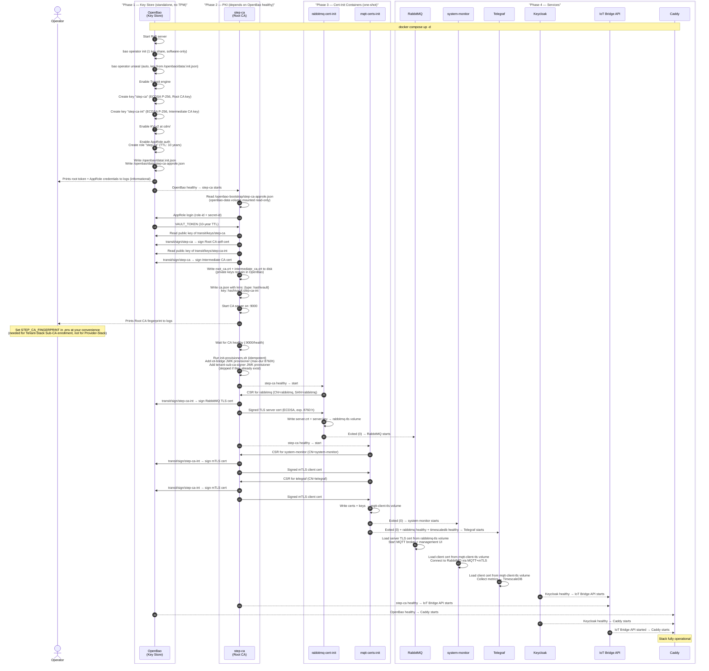
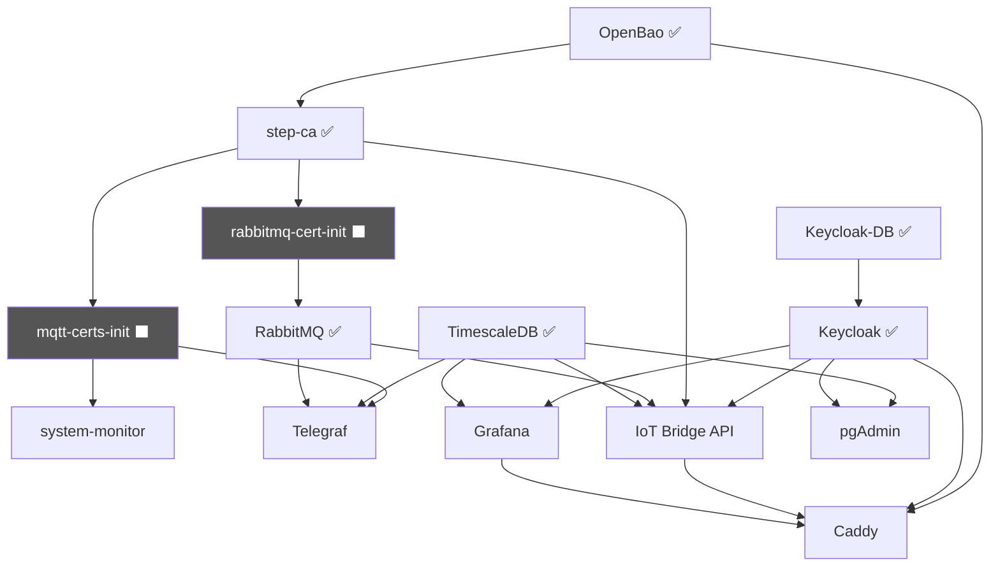

# Provider-Stack: Secret & Certificate Bootstrap

This page explains how all cryptographic material — PKI keys, TLS certificates, and
service secrets — are created, distributed, and activated during the **initial start** of
the Provider-Stack.

---

## Overview

The Provider-Stack uses a strictly ordered bootstrap sequence.  Every service waits for
its prerequisites to be healthy before starting, and one-shot init containers provision
the material that long-running services consume.

!!! info "First-boot is fully automatic — `docker compose up -d` is sufficient"
    OpenBao writes the AppRole credentials for step-ca into its data volume
    (`/openbao/data/step-ca-approle.json`) during first-time init.  That volume
    is mounted read-only into the step-ca container, which reads the credentials
    automatically if no env vars are set.

    Private CA keys **never exist on disk** — all signing operations go through
    the OpenBao Transit engine.

    Override at any time via `.env`:
    ```
    OPENBAO_STEP_CA_ROLE_ID=<role-id>
    OPENBAO_STEP_CA_SECRET_ID=<secret-id>
    ```



---

## Key Material Created During Bootstrap

| Material | Created by | Where stored | Consumed by |
|---|---|---|---|
| Root CA key (ECDSA P-256) | `openbao` entrypoint | OpenBao Transit (`transit/keys/step-ca`) | step-ca init (signs Intermediate cert once) |
| Intermediate CA key (ECDSA P-256) | `openbao` entrypoint | OpenBao Transit (`transit/keys/step-ca-int`) | step-ca (signs ALL leaf certs at runtime) |
| Root CA cert | `step-ca` (Transit-signed) | `/home/step/certs/root_ca.crt` (step-ca volume) | TLS trust anchor, Sub-CA enrollment |
| Intermediate CA cert | `step-ca` (Transit-signed) | `/home/step/certs/intermediate_ca.crt` (step-ca volume) | TLS cert chain validation |
| RabbitMQ TLS server cert | `rabbitmq-cert-init` | `rabbitmq-tls` volume | RabbitMQ MQTT+TLS listener |
| `system-monitor` mTLS client cert | `mqtt-certs-init` | `mqtt-client-tls` volume | system-monitor publisher |
| `telegraf` mTLS client cert | `mqtt-certs-init` | `mqtt-client-tls` volume | Telegraf MQTT output |
| OpenBao root token + unseal key | `openbao` entrypoint | `/openbao/data/.init.json` | Operator (first login), auto-unseal |
| AppRole `step-ca` role-id / secret-id | `openbao` entrypoint | `/openbao/data/step-ca-approle.json` (shared volume, auto-read by step-ca) | step-ca AppRole login on every start |
| Keycloak OIDC client secrets | Keycloak (auto-generated) | Keycloak DB | Grafana, IoT Bridge API, pgAdmin, RabbitMQ |

---

## Startup Dependency Graph



`⬛` = one-shot init container (exits after completion); `✅` = long-running service with healthcheck.

---

## Auto-Unseal on Subsequent Starts

After the first start, OpenBao **does not require manual intervention**:

1. The Raft storage already contains the initialised, sealed vault.
2. The entrypoint script reads `/openbao/data/.init.json` and calls `bao operator unseal`
   automatically with the stored key.
3. step-ca reads `/openbao-bootstrap/step-ca-approle.json` (or env var override),
   logs in via AppRole, and receives a fresh token.
4. All services that depend on `openbao: condition: service_healthy` start normally.

!!! warning "Protect the init file"
    `/openbao/data/.init.json` contains the **plaintext unseal key and root token**.
    The `openbao-data` Docker volume must be protected from unauthorised access.
    In production, use `OPENBAO_MODE=agent` and a hardened external Hub cluster instead.
    See [Key Store: Hub-and-Spoke Architecture](../security/hsm-agent-model.md).

---

## What Requires Manual Operator Steps?

| Step | When | Where documented |
|---|---|---|
| Set `STEP_CA_FINGERPRINT` in `.env` | After first `step-ca` start (fingerprint printed to logs) | [Provider Stack Setup – A4](provider-stack.md#a4----pki-provisioners-automatic) |
| Copy Keycloak OIDC client secrets to `.env` | After first Keycloak start | [Provider Stack Setup – A6](provider-stack.md#a6----retrieve-oidc-secrets) |
| Run `init-tenants.sh` | After first Keycloak start | [Provider Stack Setup – A7](provider-stack.md#a7----grant-superadmin-cross-realm-access) |

!!! success "PKI provisioners are no longer a manual step"
    `init-provisioners.sh` is called automatically by the `step-ca` entrypoint on
    every start.  The `iot-bridge` and `tenant-sub-ca-signer` provisioners are created
    on first boot and left unchanged on subsequent starts (idempotent).

All subsequent starts are **fully automatic** — no operator steps required.

!!! tip "AppRole credentials are bootstrapped automatically"
    OpenBao writes `step-ca-approle.json` into its data volume on first init.
    step-ca reads this file at startup — no manual credential copying required.
    To rotate: `bao write -f auth/approle/role/step-ca/secret-id`, then update
    `/openbao/data/step-ca-approle.json` or set `OPENBAO_STEP_CA_SECRET_ID` in `.env`.
