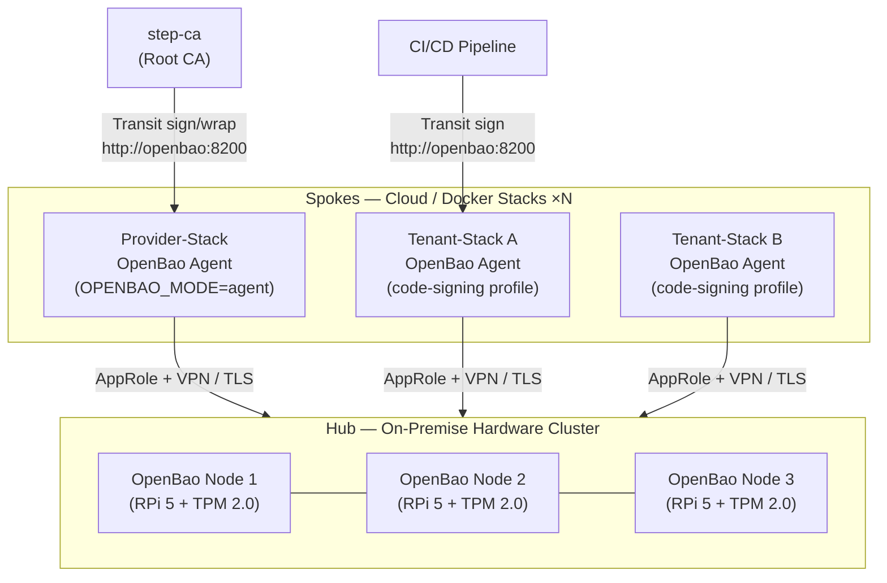

# Key Store: Hub-and-Spoke Architecture

!!! info "Production architecture — development uses embedded mode"
    For local development, CI, and single-node deployments the CDM stacks run an
    **embedded** single-node OpenBao instance (the default).  This page describes the
    **production Hub-and-Spoke setup** where a central, hardware-secured Hub cluster
    serves all provider- and tenant-stack deployments.
    Switch mode via `OPENBAO_MODE=agent` in your `.env`
    (see `provider-stack/openbao/.env.ha-example`).

---

## 1. Overview: Hub-and-Spoke Model

For production deployments — especially when operating across multiple cloud regions or
managing large device fleets — the CDM platform uses a **Hub-and-Spoke** architecture for
key management:



**Hub** — hosts the Root of Trust.  All master keys reside here, never in any cloud
environment.  TPM 2.0-backed auto-unseal ensures zero-touch operation.

**Spoke** — an OpenBao Agent running inside each Docker Compose stack.  It
transparently proxies all secret and key operations to the Hub.  From the perspective
of application services (step-ca, CI/CD pipelines), it looks exactly like a local
OpenBao server on `http://openbao:8200`.

---

## 2. The Hub: Hardware-Secured Root of Trust

The Hub is a 3-node Raft cluster running on Raspberry Pi 5 hardware with
[Infineon Optiga SLB9672 TPM 2.0](https://www.infineon.com/cms/en/product/security-smart-card-solutions/optiga-embedded-security-solutions/optiga-tpm/) modules.

### Key Responsibilities

| Engine | Purpose |
|---|---|
| **Transit** (key `step-ca`) | Root CA key operations for the Provider step-ca via step-kms-plugin |
| **Transit** (key `code-signing`) | OTA bundle / RAUC artefact signing for Tenant-Stacks |
| **KV-v2** (mount `cdm/`) | Platform-wide secrets (API keys, service credentials) |
| **KV-v2** (mount `code-signing/`) | Tenant code-signing certificate storage |
| **AppRole** | Machine-to-machine auth for all spokes |

### Security Properties

- **Keys never leave the Hub.** Transit engine performs all cryptographic operations
  on the Hub; only signatures and ciphertext travel over the network.
- **Network isolation.** The Hub exposes port 8200 exclusively via a WireGuard VPN tunnel
  to authorised cloud stacks; no public internet exposure.
- **Audit trail.** All key operations are logged centrally at the Hub — a single
  compliance audit source for medical / automotive / industrial certifications.
- **TPM auto-unseal.** See [HA & Disaster Recovery](hsm-disaster-recovery.md) for
  the full unseal architecture.

---

## 3. The Spoke: OpenBao Agent

Each Docker Compose stack that requires cryptographic operations runs an **OpenBao Agent**
container.  This is the same container used in `embedded` mode — only `OPENBAO_MODE` changes.

### Agent Capabilities

| Feature | Details |
|---|---|
| **Auto-Auth** | Agent authenticates automatically via AppRole; no static token in `.env` |
| **Token Caching** | Renews Hub tokens transparently; services see a permanent local token |
| **Secret Caching** | KV secrets are cached to reduce Hub round-trips |
| **Request Proxying** | Transit sign/verify requests are forwarded directly to the Hub |
| **Offline Resilience** | Cached secrets remain available when Hub is briefly unreachable |

### How Application Services See the Agent

Services inside the stack connect to `http://openbao:8200` — the Docker service name
resolves to the Agent container regardless of whether `OPENBAO_MODE` is `embedded` or
`agent`.  **No application changes are needed when switching modes.**

---

## 4. Configuration

### Provider-Stack Spoke

In `provider-stack/.env` (or override via `openbao/.env.ha-example`):

```ini
OPENBAO_MODE=agent

# Hub cluster address (reachable via VPN)
OPENBAO_HUB_ADDR=https://openbao-hub.yourdomain.example:8200

# AppRole credentials issued by the Hub for the cdm-provider-spoke role
OPENBAO_APPROLE_ROLE_ID=<role-id>
OPENBAO_APPROLE_SECRET_ID=<secret-id>

# Unchanged from embedded mode – services use these to retrieve secrets
OPENBAO_TRANSIT_KEY_NAME=step-ca
OPENBAO_KV_PATH=cdm
OPENBAO_STEP_CA_ROLE_ID=<role-id same or different>
OPENBAO_STEP_CA_SECRET_ID=<secret-id>
```

### Tenant-Stack Spoke (code-signing profile)

In `tenant-stack/.env`:

```ini
COMPOSE_PROFILES=code-signing
OPENBAO_MODE=agent
OPENBAO_PORT=18200

OPENBAO_HUB_ADDR=https://openbao-hub.yourdomain.example:8200
OPENBAO_APPROLE_ROLE_ID=<code-signer role-id>
OPENBAO_APPROLE_SECRET_ID=<secret-id>
OPENBAO_KV_PATH=code-signing
OPENBAO_CODESIGN_KEY_NAME=code-signing
```

### Agent Configuration (generated at runtime)

The entrypoint script generates the HCL config at container start from the env vars above:

```hcl
# Generated by provider-stack/openbao/entrypoint.sh (OPENBAO_MODE=agent)
exit_after_auth = false
pid_file        = "/tmp/bao-agent.pid"

vault {
  address = "https://openbao-hub.yourdomain.example:8200"
}

auto_auth {
  method "approle" {
    config = {
      role_id_file_path              = "/openbao/data/agent-role-id"
      secret_id_file_path            = "/openbao/data/agent-secret-id"
      remove_secret_id_file_after_reading = false
    }
  }
  sink "file" {
    config = {
      path = "/openbao/data/agent-token"
      mode = 0600
    }
  }
}

cache {
  use_auto_auth_token = true
}

listener "tcp" {
  address     = "0.0.0.0:8200"
  tls_disable = true  # TLS terminated by Caddy (/vault/) or VPN
}
```

---

## 5. Hub Setup: Initial AppRole Configuration

Before switching stacks to agent mode, configure the Hub once:

```bash
# On the Hub (or via the Hub API)
export VAULT_ADDR=https://openbao-hub.yourdomain.example:8200
export VAULT_TOKEN=<root-or-admin-token>

# Enable engines (if not already done)
bao secrets enable transit
bao secrets enable -path=cdm kv-v2
bao secrets enable -path=code-signing kv-v2
bao auth enable approle

# Create the Transit key for step-ca (Provider-Stack)
bao write transit/keys/step-ca         type=ecdsa-p256  exportable=false

# Create the Transit key for code-signing (Tenant-Stacks)
bao write transit/keys/code-signing    type=ecdsa-p384  exportable=false

# Write the Provider-Stack spoke policy
bao policy write cdm-provider-spoke - << 'EOF'
path "transit/sign/step-ca"    { capabilities = ["create","update"] }
path "transit/verify/step-ca"  { capabilities = ["create","update"] }
path "transit/keys/step-ca"    { capabilities = ["read"] }
path "cdm/data/*"              { capabilities = ["create","read","update","delete"] }
path "cdm/metadata/*"          { capabilities = ["list","read"] }
EOF

# Write the Tenant code-signing spoke policy
bao policy write cdm-tenant-codesigning - << 'EOF'
path "transit/sign/code-signing"    { capabilities = ["create","update"] }
path "transit/verify/code-signing"  { capabilities = ["create","update"] }
path "transit/keys/code-signing"    { capabilities = ["read"] }
path "code-signing/data/*"          { capabilities = ["create","read","update","delete"] }
path "code-signing/metadata/*"      { capabilities = ["list","read"] }
EOF

# Create AppRoles
bao write auth/approle/role/cdm-provider-spoke \
  token_policies="cdm-provider-spoke" token_ttl=1h token_max_ttl=24h
bao write auth/approle/role/cdm-tenant-codesigning \
  token_policies="cdm-tenant-codesigning" token_ttl=1h token_max_ttl=8h

# Retrieve credentials and add to spoke .env files
echo "Role-ID (provider): $(bao read -format=json auth/approle/role/cdm-provider-spoke/role-id | jq -r .data.role_id)"
echo "Secret-ID (provider): $(bao write -f -format=json auth/approle/role/cdm-provider-spoke/secret-id | jq -r .data.secret_id)"
```

---

## 6. Operational Notes

!!! tip "Development stays embedded"
    There is no need to run the Hub setup for local development.  Just leave
    `OPENBAO_MODE=embedded` (the default) and the stack self-configures.

!!! warning "Rotate secret-ids regularly"
    AppRole `secret-id` values should be rotated on a schedule (monthly or per deployment).
    Use `bao write -f auth/approle/role/<role>/secret-id` on the Hub and update the
    spoke `.env` file, then restart the stack's `openbao` container.

!!! warning "Secret-id file protection"
    In agent mode the secret-id is written to `/openbao/data/agent-secret-id` inside the
    container.  Protect the `openbao-data` volume with appropriate filesystem permissions.

!!! info "Cached secrets during Hub outage"
    When the Hub is unreachable, the Agent serves cached secrets (KV reads remain available).
    Transit operations (signing) **fail** if the Hub is down — this is intentional to prevent
    signing with stale or potentially compromised keys.

---

## 7. Migration: Embedded → Agent

If you are already running with `OPENBAO_MODE=embedded` and want to migrate to the Hub:

1. **Export existing KV secrets** from the embedded instance:
   ```bash
   # Use the OpenBao UI at /vault/ui or the CLI
   bao kv get -format=json cdm/data/my-secret
   ```
2. **Recreate secrets on the Hub** (or use `bao kv put`).
3. **Export keys** — Transit keys cannot be exported if `exportable=false`.  Re-create
   the Transit keys on the Hub and update any key references (e.g., re-sign
   existing code-signing certificates against the new key).
4. **Update `.env`** with `OPENBAO_MODE=agent` and Hub credentials.
5. `docker compose restart openbao` — the new entrypoint switches to agent mode.
