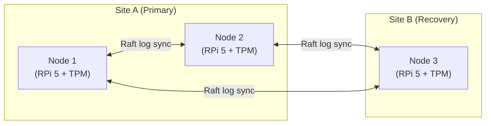

# Key Store: High-Availability & Disaster Recovery

!!! info "Hub cluster specification"
    This document describes the hardware security model and disaster recovery procedure
    for the on-premise OpenBao Hub cluster. It applies only when running in
    `OPENBAO_MODE=agent` (Hub-and-Spoke production mode).
    For development / embedded mode, see [Key Management](../architecture/key-management.md).

---

## 1. Overview

The Hub is a **3-node Raft cluster** for fault tolerance and consistent key storage, running on
Raspberry Pi 5 hardware with TPM 2.0 auto-unseal.

---

## 2. Cluster Architecture & Geographic Redundancy

The Hub uses the **Raft Consensus Protocol** for data consistency and fault tolerance across nodes.

### 2.1 Node Distribution (2+1 Strategy)



| Site | Nodes | Role |
|---|---|---|
| **Site A (Primary)** | 2 (Raspberry Pi 5) | Maintains local quorum |
| **Site B (Recovery)** | 1 (Raspberry Pi 5) | Geographic redundancy |


### 2.2 Quorum Dynamics

- **Normal operation:** all 3 nodes synchronise the encrypted Raft log.
- **Site B failure:** Site A keeps quorum (2 / 3) — fully operational.
- **Site A failure:** Site B enters standby until a second node is restored.

---

## 3. Hardware-Rooted Security: TPM Auto-Unseal

Each node is equipped with an **Infineon Optiga SLB9672 TPM 2.0** module (SPI-connected).

### 3.1 Autonomous Operation

OpenBao is configured for **Auto-Unseal** via the TPM.  The Master Key is wrapped inside
the hardware chip at first-time initialisation.

- **Zero-touch boot:** on power-on the node communicates with its local TPM; if hardware
  integrity PCRs match, the vault unseals automatically — no operator action required.
- **Device binding:** the unseal key is unique to each TPM chip; the key never leaves the
  physical TPM silicon.
- **Tamper detection:** if PCR registers fail (e.g. firmware tampered), the TPM refuses to
  release the key and the node halts — manual intervention required.

### 3.2 OpenBao seal configuration

```hcl
# /etc/openbao/config.hcl (Hub nodes only)
seal "tpm" {
  # Uses the go-tpm-tools community seal plugin
  # github.com/hashicorp/go-tpm-tools (or equivalent OpenBao fork)
}
```

!!! warning "TPM binding"
    Each unseal key is bound to its specific TPM chip.  If a node's hardware is
    replaced, the Disaster Recovery procedure below must be followed to re-bind to
    the new TPM.

---

## 4. Key Distribution: Weighted Shamir's Secret Sharing

To protect against total hardware loss (fire, flood, theft), the Master Encryption Key is split
using **Weighted Shamir's Secret Sharing**.

### 4.1 Scheme: threshold $T = 5$, total share weight $N = 8$

| Holder | Count | Shares (weight per unit) |
|---|---|---|
| Authorised staff | 5 persons | 1 share each (keys 1–5) |
| Site A safe | 1 location | 3 shares (keys 6, 7, 8) |
| Site B safe | 1 location | 3 shares (keys 6, 7, 8) – identical copy |

### 4.2 Authorised access scenarios

| Scenario | Parties | Total weight | Authorised? |
|---|---|---|---|
| Standard | 5 staff | $5 \times 1 = 5$ | ✅ |
| Emergency hybrid | 2 staff + 1 safe | $2 + 3 = 5$ | ✅ |
| Safe only | 1 safe | $3$ | ❌ |
| Partial staff | 4 staff | $4$ | ❌ |

Both safes hold **identical** share sets so that either site can facilitate recovery
without granting unilateral access to a single site manager.

---

## 5. Storage & Backup

### 5.1 Data Persistence

- **Primary storage:** encrypted Raft log on local SSD per node (`/openbao/data`).
- Raft replication ensures consistency across all 3 nodes automatically.

### 5.2 Automated Backups

| Mechanism | Frequency | Destination |
|---|---|---|
| Raft snapshot (cron) | Daily | Encrypted S3/object store |
| Volume snapshot | Weekly | Offsite cold storage |

Both safes (Site A and Site B) contain the **identical set of 3 shares** (keys 6, 7, 8).
This ensures that either site can facilitate a recovery without granting the site manager
unilateral authority.

```bash
# Take a manual Raft snapshot (run on the Leader node)
bao operator raft snapshot save /backup/raft-$(date +%Y%m%d).snap

# Verify snapshot integrity
bao operator raft snapshot inspect /backup/raft-$(date +%Y%m%d).snap
```

---

## 6. Disaster Recovery Workflow

Use this procedure when the entire cluster is destroyed and cannot auto-recover.

### Step 1: Provision new hardware

```bash
# On each new Raspberry Pi 5 node:
apt install openbao   # or download the OpenBao binary
mkdir -p /etc/openbao /openbao/data
```

### Step 2: Restore the Raft snapshot

```bash
# Retrieve the latest snapshot from object storage
aws s3 cp s3://cdm-backups/openbao/raft-latest.snap /tmp/raft-restore.snap

# Restore to the new node
bao operator raft snapshot restore /tmp/raft-restore.snap
```

### Step 3: Manual unseal (collect Shamir shares)

```bash
# Repeat until threshold T=5 is reached
bao operator unseal   # share 1
bao operator unseal   # share 2
# ...
```

!!! tip "Four-eyes principle"
    Each share entry must be performed by the corresponding key holder.  The safe
    shares (keys 6–8) require physical presence at the respective site.

### Step 4: Migrate seal to new TPMs

After manual unseal, re-wrap the Master Key to the new TPM chips:

```bash
bao operator migrate
# The system re-seals with the new TPMs and returns to auto-unseal mode
```

### Step 5: Rejoin cluster

```bash
# On nodes 2 and 3:
bao operator raft join https://node1.openbao.internal:8200
```

### Step 6: Reissue spoke AppRole credentials

After recovery, rotate all AppRole `secret-id` values issued to Provider- and
Tenant-Stack spokes:

```bash
export VAULT_ADDR=https://openbao-hub.yourdomain.example:8200
export VAULT_TOKEN=<root-token>

bao write -f auth/approle/role/cdm-provider-spoke/secret-id
bao write -f auth/approle/role/cdm-tenant-codesigning/secret-id
```

Update `OPENBAO_APPROLE_SECRET_ID` in each stack's `.env` and restart the `openbao` container.

---

## 7. Security Checklist for Hub Operations

| Check | Recommendation |
|---|---|
| RPi firmware | Verify `rpi-eeprom` signatures before deployment |
| OS hardening | Disable unused services; SSH key-only; firewall restrict to WireGuard peers |
| Network isolation | Hub port 8200 reachable **only** via WireGuard VPN |
| VPN access | One WireGuard peer per CDM stack; revoke on decommissioning |
| AppRole rotation | Rotate `secret-id` at least monthly or per deployment |
| Raft snapshot test | Test restore procedure quarterly |
| Share audit | Confirm key holders annually; rotate if personnel changes |
| TPM PCR validation | Verify PCR baseline after any firmware update |
