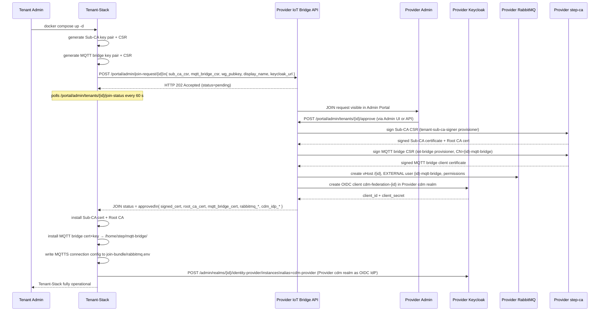

# Tenant Onboarding

This use case describes how a new tenant joins the CDM platform — from the tenant's first
`docker compose up` to a fully operational device management environment.

---

## Roles

| Role | Person | Responsibility |
|---|---|---|
| **Provider Admin** | CDM platform operator | Reviews and approves JOIN requests; manages RabbitMQ, PKI, Keycloak federation |
| **Tenant Admin** | Customer administrator | Deploys and configures the Tenant-Stack; manages tenant devices and users |

---

## Sequence Overview



---

## Step-by-Step (Tenant Perspective)

### 1. Start the Tenant-Stack

```bash
git clone https://github.com/the78mole/complete-device-management.git
cd complete-device-management/tenant-stack
cp .env.example .env
```

Edit `.env` — at a minimum set:

```dotenv
TENANT_ID=acme-devices           # unique slug, no spaces
TENANT_DISPLAY_NAME=Acme Devices GmbH
PROVIDER_API_URL=https://cdm.example.com/api
# optional, for Keycloak federation:
TENANT_KEYCLOAK_URL=https://acme-devices.example.com/auth
```

```bash
docker compose up -d
```

On first boot the step-ca container generates its Sub-CA key pair, creates a CSR and
automatically calls `POST /portal/admin/join-request/<TENANT_ID>` on the Provider API.

### 2. Wait for Provider Approval

The step-ca init container polls `GET /portal/admin/tenants/<TENANT_ID>/join-status` every
60 seconds (configurable via `JOIN_POLL_INTERVAL`).  Once the Provider Admin approves:

- The signed Sub-CA certificate is installed.
- The Provider Root CA certificate replaces the self-signed one.
- The MQTT bridge client certificate is installed to `/home/step/mqtt-bridge/`.
- MQTTS connection config (mTLS) is written to `/home/step/join-bundle/rabbitmq.env`.
- Provider Keycloak is registered as an Identity Provider (`cdm-provider`) in the Tenant Keycloak.
  CDM Admins can now log into Tenant services (ThingsBoard, Grafana) via Provider KC SSO.
- Federation credentials are written to `/home/step/join-bundle/keycloak-federation.env`.

You can check the current status at any time:

```bash
docker compose exec ${TENANT_ID}-step-ca \
  curl -sf http://provider.iot.example.com/api/portal/admin/tenants/${TENANT_ID}/join-status \
  | python3 -m json.tool
```

### 3. Verify Connectivity

```bash
# Sub-CA chain is trusted by Provider Root CA
docker compose exec ${TENANT_ID}-step-ca step ca health

# Confirm certificate chain is complete
docker compose exec ${TENANT_ID}-step-ca \
  step certificate verify /home/step/certs/intermediate_ca.crt \
    --roots /home/step/certs/root_ca.crt
```

---

## Step-by-Step (Provider Admin Perspective)

### 1. Review Pending JOIN Requests

Open the CDM Provider Portal at **`http://localhost:8888/api/portal/`** and log in with
your `platform-admin` credentials.

Navigate to **Admin → Tenant-Verwaltung** — the **JOIN-Anfragen** section at the top shows
pending requests with:

- Tenant ID and display name
- Submitted Sub-CA CSR (click "CSR anzeigen" to inspect)
- Request timestamp

### 2. Approve the Request

Click **✓ Genehmigen**.  After confirming, the IoT Bridge API automatically:

1. Signs the Sub-CA CSR with the Provider step-ca `tenant-sub-ca-signer` provisioner.
2. Signs the MQTT bridge CSR (CN = `{tenant-id}-mqtt-bridge`) with the `iot-bridge` provisioner.
3. Creates a RabbitMQ vHost `/{tenant-id}`, EXTERNAL-auth user `{tenant-id}-mqtt-bridge`, and
   full permissions.  Authentication is via mTLS — **no password is issued**.
4. Creates an OIDC client `cdm-federation-{tenant-id}` in the **Provider `cdm` realm**
   and returns the credentials in the bundle.  The Tenant-Stack then registers the
   **Provider Keycloak as an Identity Provider** (`cdm-provider`) in the Tenant Keycloak,
   so CDM Admins can log into Tenant services via Provider KC SSO.
   (Only if `keycloak_url` was provided in the JOIN request, otherwise recorded for manual setup.)

To approve via API:

```bash
curl -sf -X POST \
  "http://localhost:8888/api/portal/admin/tenants/acme-devices/approve" \
  -H "Content-Type: application/json" \
  -d '{}'
```

### 3. Verify the New Tenant

```bash
# RabbitMQ vHost and EXTERNAL user exist
docker compose -f provider-stack/docker-compose.yml exec rabbitmq \
  rabbitmqctl list_vhosts
docker compose -f provider-stack/docker-compose.yml exec rabbitmq \
  rabbitmqctl list_users

# MQTTS port 8883 is accessible
curl -sk --cert /home/step/mqtt-bridge/client.crt \
     --key /home/step/mqtt-bridge/client.key \
     --cacert /home/step/mqtt-bridge/ca.crt \
     https://provider-host:8883/ || echo "Port reachable"

# Keycloak federation client created in Provider cdm realm
curl -sf -H "Authorization: Bearer $(curl -sf \
  http://localhost:8080/auth/realms/master/protocol/openid-connect/token \
  -d 'grant_type=password&client_id=admin-cli&username=admin&password=changeme' \
  | python3 -m json.tool | grep access_token | cut -d'"' -f4)" \
  http://localhost:8080/auth/admin/realms/cdm/clients \
  | python3 -c "import sys,json; [print(c['clientId']) for c in json.load(sys.stdin) if 'cdm-federation' in c['clientId']]"

# Provider KC registered as IdP in Tenant KC
docker compose exec ${TENANT_ID:-tenant}-step-ca \
  curl -sf http://keycloak:8080/auth/admin/realms/${TENANT_ID}/identity-provider/instances \
  | python3 -c "import sys,json; [print(i['alias'], i['enabled']) for i in json.load(sys.stdin)]"
```

---

## API Reference

| Method | Path | Auth | Description |
|---|---|---|---|
| `POST` | `/portal/admin/join-request/{id}` | None | Tenant submits CSR + WG key |
| `GET` | `/portal/admin/join-requests` | CDM admin | List all requests |
| `GET` | `/portal/admin/tenants/{id}/join-status` | None | Tenant polls status |
| `POST` | `/portal/admin/tenants/{id}/approve` | CDM admin | Sign CSR + provision |
| `POST` | `/portal/admin/tenants/{id}/reject` | CDM admin | Reject with reason |

**JOIN request payload** (`POST /portal/admin/join-request/{id}`):

```json
{
  "display_name": "Acme Devices GmbH",
  "sub_ca_csr": "-----BEGIN CERTIFICATE REQUEST-----\n...",
  "mqtt_bridge_csr": "-----BEGIN CERTIFICATE REQUEST-----\n...",
  "wg_pubkey": "<base64 WireGuard public key>",
  "keycloak_url": "https://acme-devices.example.com/auth"
}
```

**JOIN status response** (once approved):

```json
{
  "tenant_id": "acme-devices",
  "status": "approved",
  "signed_cert": "-----BEGIN CERTIFICATE-----\n...",
  "root_ca_cert": "-----BEGIN CERTIFICATE-----\n...",
  "mqtt_bridge_cert": "-----BEGIN CERTIFICATE-----\n...",
  "rabbitmq_url": "http://rabbitmq:15672",
  "rabbitmq_vhost": "acme-devices",
  "rabbitmq_user": "acme-devices-mqtt-bridge",
  "cdm_idp_client_id": "cdm-federation-acme-devices",
  "cdm_idp_client_secret": "<secret>",
  "cdm_discovery_url": "https://cdm.example.com/auth/realms/cdm/.well-known/openid-configuration"
}
```

> **Keycloak federation direction:** The Provider Keycloak `cdm` realm acts as the
> **Identity Provider** for the Tenant Keycloak.  CDM Admins log into Tenant services
> (ThingsBoard, Grafana) via the Provider Keycloak SSO — no separate Tenant accounts needed.
> The Tenant-Stack configures this automatically using the returned `cdm_idp_*` credentials.

> **mTLS authentication:** The MQTT bridge connects to `mqtts://<provider-host>:8883` using
> `mqtt_bridge_cert` + `client.key` (private key stays on the Tenant-Stack).
> RabbitMQ maps the certificate CN (`acme-devices-mqtt-bridge`) to the MQTT username
> via `EXTERNAL` auth — no password is transmitted or stored.

---

## Post-Onboarding: Assign Users

After the tenant is onboarded, CDM Admins can log into the Tenant services using their
**Provider Keycloak** (`cdm` realm) credentials via the `cdm-provider` Identity Provider.

To enable a CDM Admin to access Tenant resources:

1. Open the **Tenant Keycloak** at `https://<tenant>/auth/realms/<TENANT_ID>/` and log in
   as the Tenant Keycloak admin.
2. Go to **Identity Providers → cdm-provider → Mappers** and add a role mapper:
   - Sync mode: `FORCE`
   - Mapper type: `Hardcoded Role` or `Role Name Mapper`
   - Map `cdm-admin` (Provider role) → `cdm-admin` (Tenant role)
3. CDM Admins with the `cdm-admin` role in the Provider `cdm` realm can now log into
   ThingsBoard, Grafana, and the Tenant Portal by clicking **"CDM Platform"** on the
   Tenant Keycloak login page.

The Tenant Admin can add their own users directly in the Tenant Keycloak at
`/auth/realms/<TENANT_ID>/`, independently of the Provider federation.
