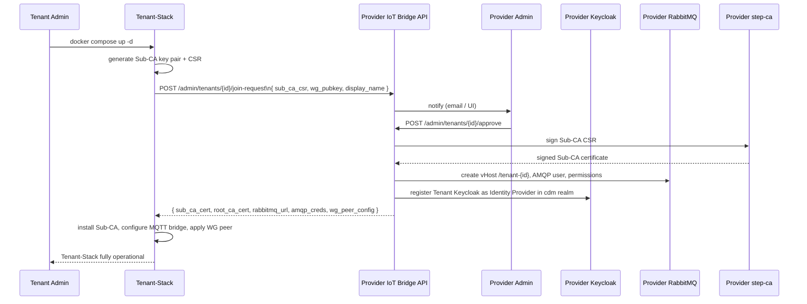

# Tenant Onboarding

This use case describes how a new tenant joins the CDM platform — from the tenant's first
`docker compose up` to a fully operational device management environment.

!!! note "Phase 3 — JOIN workflow"
    The automated API-driven JOIN workflow is planned for Phase 3.  This page describes
    the target state.  Until Phase 3 ships, steps 4–6 are performed manually.

---

## Roles

| Role | Person | Responsibility |
|---|---|---|
| **Provider Admin** | CDM platform operator | Reviews and approves JOIN requests; manages RabbitMQ, PKI, Keycloak federation |
| **Tenant Admin** | Customer administrator | Deploys and configures the Tenant-Stack; manages tenant devices and users |

---

## Sequence Overview



---

## Step-by-Step (Tenant Perspective)

### 1. Start the Tenant-Stack

```bash
git clone https://github.com/the78mole/complete-device-management.git
cd complete-device-management/tenant-stack
cp .env.example .env
```

Edit `.env` — at a minimum set:

```dotenv
TENANT_ID=acme-devices           # unique slug, no spaces
TENANT_DISPLAY_NAME=Acme Devices GmbH
PROVIDER_API_URL=https://cdm.example.com/api
STEP_CA_FINGERPRINT=<provider root CA fingerprint>   # from provider admin
```

```bash
docker compose up -d
```

On first boot the Tenant-Stack generates its Sub-CA key pair and sends the JOIN request
to `PROVIDER_API_URL`.

### 2. Wait for Provider Approval

The Tenant-Stack polls the Provider API every 60 s.  Once the Provider Admin approves the
request, the Tenant-Stack automatically receives the signed Sub-CA certificate, RabbitMQ
credentials, and WireGuard peer configuration and reconfigures itself.

You can check the status:

```bash
docker compose exec iot-bridge-api curl -s http://localhost:8000/admin/join-status
```

### 3. Verify Connectivity

```bash
# Sub-CA received and trusted
docker compose exec step-ca step ca health

# RabbitMQ AMQP bridge active
docker compose exec rabbitmq-bridge rabbitmq-diagnostics status
```

---

## Step-by-Step (Provider Admin Perspective)

### 1. Review Pending JOIN Requests

Open the CDM Provider Portal at **http://localhost:8888/api/portal/** and log in with your
`platform-admin` credentials.

Navigate to **Tenants → Pending Requests** — you will see the new request with:
- Tenant ID and display name
- Submitted Sub-CA CSR (fingerprint shown)
- WireGuard public key
- Timestamp

### 2. Approve the Request

Click **Approve**.  The IoT Bridge API then automatically:

1. Signs the Sub-CA CSR with the Provider Intermediate CA.
2. Creates a RabbitMQ vHost `/tenant-<id>`, AMQP user, and permissions.
3. Registers the Tenant Keycloak realm as an OIDC Identity Provider in the `cdm` realm.
4. Sends the bundle back to the Tenant-Stack.

To approve via API:

```bash
source provider-stack/.env
TOKEN=$(bash .github/skills/cdm-keycloak/scripts/kc-token.sh)

curl -sf -X POST \
  "http://localhost:8888/api/admin/tenants/acme-devices/approve" \
  -H "Authorization: Bearer $TOKEN"
```

### 3. Verify the New Tenant

```bash
# RabbitMQ vHost exists
docker compose -f provider-stack/docker-compose.yml exec rabbitmq \
  rabbitmqctl list_vhosts

# Keycloak Identity Provider registered
curl -sf -H "Authorization: Bearer $TOKEN" \
  "http://localhost:8888/auth/admin/realms/cdm/identity-provider/instances" \
  | python3 -c "import sys,json; [print(i['alias']) for i in json.load(sys.stdin)]"
```

---

## Post-Onboarding: Assign Users

After the tenant is onboarded, the Provider Admin can assign `platform-admin` or
`platform-operator` access to the tenant realm via the Keycloak federation:

1. Open **Provider Keycloak → `cdm` realm → Identity Providers → `tenant-acme`**.
2. Configure role mappers to map `platform-admin` → `cdm-admin` in the tenant realm.

The Tenant Admin can add their own users directly in the Tenant Keycloak.
