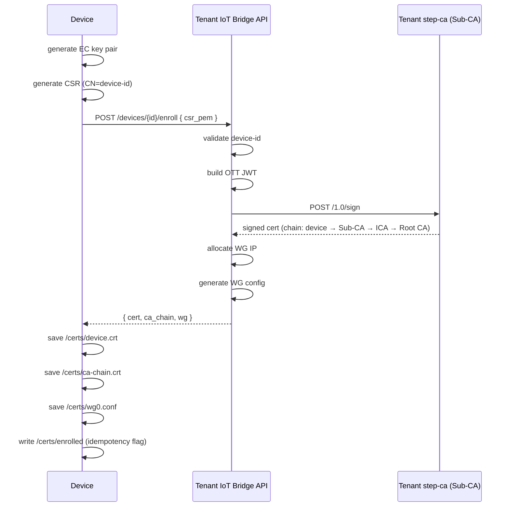
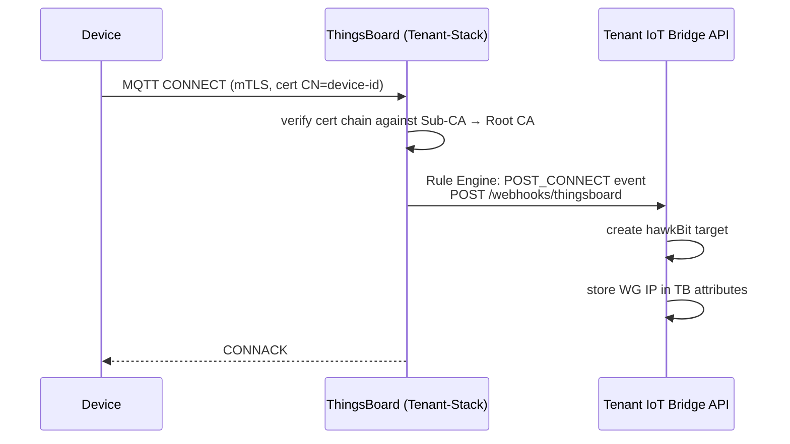
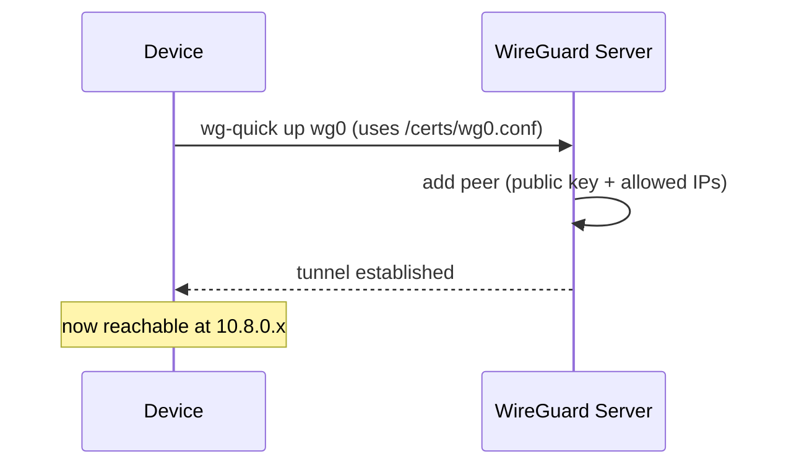

# Device Provisioning Workflow

This page is the complete operational runbook for the zero-touch device provisioning flow.

!!! info "Stack context"
    All provisioning components (IoT Bridge API, step-ca Sub-CA, ThingsBoard, WireGuard)
    reside in the **Tenant-Stack**.  The "step-ca Sub-CA" is the Issuing CA for a specific
    tenant; it is itself signed by the Provider Root CA.

---

## Overview

Zero-touch provisioning means a device can be unboxed, powered on, and fully registered in the platform without any manual intervention. The process relies on:

- A pre-installed `enroll.sh` script (or `rauc-hawkbit-updater` equivalent) baked into the Yocto image.
- The device knowing only: the `iot-bridge-api` URL and the step-ca root CA fingerprint.
- No pre-shared passwords — only asymmetric cryptography.

---

## Step-by-Step Flow

### Phase 1 — Factory Enrollment (first boot)



### Phase 2 — First MQTT Connection



### Phase 3 — Device Registers with WireGuard



---

## Configuration Reference

### iot-bridge-api Environment Variables

| Variable | Description | Example |
|---|---|---|
| `STEP_CA_URL` | Tenant step-ca Sub-CA API endpoint | `https://tenant-step-ca:9000` |
| `STEP_CA_FINGERPRINT` | Sub-CA SHA-256 fingerprint | `abc123...` |
| `STEP_CA_PROVISIONER_NAME` | JWK provisioner name | `iot-bridge` |
| `STEP_CA_PROVISIONER_PASSWORD` | JWK provisioner decrypt password | `...` |
| `HAWKBIT_URL` | hawkBit server URL (Tenant-Stack) | `http://tenant-hawkbit:8090` |
| `WG_SUBNET` | WireGuard allocation subnet | `10.8.0.0/24` |
| `WG_SERVER_ENDPOINT` | Public WireGuard endpoint | `vpn.example.com:51820` |
| `WG_SERVER_PUBLIC_KEY` | WireGuard server public key | `...` |

---

## Re-Enrollment

If a device loses its certificate (e.g. storage failure), delete the idempotency flag and re-run enrollment:

```bash
rm /certs/enrolled
/opt/cdm/enroll.sh
```

The `device_id` is preserved; a new key pair and certificate are generated.

---

## Decommissioning a Device

1. Revoke the device certificate in step-ca.
2. Delete the device from ThingsBoard.
3. Remove the device target from hawkBit.
4. Remove the WireGuard peer from the server config:
   ```bash
   wg set wg0 peer <device-public-key> remove
   wg-quick save wg0
   ```
5. Delete the device entry from `cdm_peers.json` (in the `wg-data` volume).

---

## Troubleshooting

| Problem | Cause | Fix |
|---|---|---|
| 422 on POST /enroll | Invalid CSR PEM | Re-generate CSR with correct CN |
| 503 on POST /enroll | step-ca unreachable | Check `STEP_CA_URL`, CA container health |
| MQTT CONNREFUSED | ThingsBoard not accepting mTLS | Check device profile, CA chain loaded |
| WireGuard not connecting | Server public key mismatch | Verify `WG_SERVER_PUBLIC_KEY` in `.env` |
