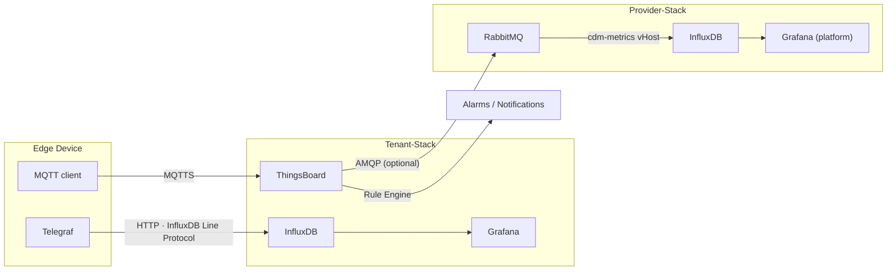

# Monitoring & Telemetry Workflow

This page covers how device metrics flow from the edge to InfluxDB and how to use the
Grafana dashboards.

---

## Architecture



**Principle:** High-frequency, high-cardinality data (every 10 seconds per device) goes
directly to the Tenant InfluxDB.  Business-logic data (device state, alarms, OTA status)
goes through ThingsBoard.  Optionally, the ThingsBoard Rule Engine forwards aggregated
platform-health metrics via RabbitMQ to the Provider InfluxDB for fleet-wide visibility.

---

## Telegraf Configuration

The Telegraf config is at `device-stack/telegraf/telegraf.conf`. Key sections:

### Inputs

| Plugin | Metrics | Interval |
|---|---|---|
| `cpu` | usage_user, usage_system, usage_idle | 10s |
| `mem` | used_percent, available, free | 10s |
| `disk` | used_percent, free, total | 30s |
| `net` | bytes_sent, bytes_recv, drop_in, drop_out | 10s |
| `exec` | Custom metrics from user scripts | configurable |
| `mqtt_consumer` | Parses device MQTT messages as tags | on message |

### Output — Tenant InfluxDB v2

```toml
[[outputs.influxdb_v2]]
  urls = ["http://tenant-influxdb:8086"]
  token = "${INFLUXDB_TOKEN}"
  organization = "cdm"
  bucket = "device-telemetry"
  timeout = "5s"
```

### Adding Custom Metrics

To collect application-specific metrics, add an `exec` input:

```toml
[[inputs.exec]]
  commands = ["/opt/cdm/metrics/my-app-metrics.sh"]
  timeout = "5s"
  data_format = "influx"
  interval = "30s"
```

The script must output InfluxDB line protocol, e.g.:
```
my_app,device_id=device-001 queue_depth=42i,error_rate=0.01 1700000000000000000
```

---

## InfluxDB Buckets

**Tenant InfluxDB** (device-facing):

| Bucket | Retention | Content |
|---|---|---|
| `device-telemetry` | 30 days | All Telegraf metrics |
| `device-events` | 90 days | Device state changes, OTA events |

**Provider InfluxDB** (platform-facing):

| Bucket | Retention | Content |
|---|---|---|
| `platform-health` | 90 days | Aggregated metrics from all tenants via RabbitMQ |
| `cdm-audit` | 1 year | Enrollment events, revocations |

Buckets are created by the respective `monitoring/influxdb/init-scripts/01-init-buckets.sh`
on first start.

---

## Grafana Dashboards

Grafana is pre-provisioned with two dashboards:

### Device Overview

Shows for a selected device (variable `$device_id`):

- CPU usage (sparkline + gauge)
- Memory used %
- Disk used %
- Network throughput (bytes sent/recv)
- Top processes by CPU (from `exec` plugin)

### Fleet Summary

Shows across all devices:

- Online device count (last heartbeat < 5 min)
- P50 / P95 CPU usage across fleet
- OTA success rate (from `device-events` bucket)
- Devices with disk > 80%

---

## Embedding Grafana in ThingsBoard

Grafana dashboards are embedded in ThingsBoard via iframes. To allow anonymous access from within the ThingsBoard UI:

1. In Grafana, go to **Configuration → Data Sources → InfluxDB** and ensure the datasource is working.
2. Enable anonymous access restricted to a specific organisation:
   ```ini
   [auth.anonymous]
   enabled = true
   org_name = CDM
   org_role = Viewer
   ```
3. In ThingsBoard, add an **iframe Widget** and set the URL to:
   ```
   http://grafana:3000/d/<dashboard-uid>/device-overview?orgId=1&var-device_id=${entityId}
   ```

!!! warning "Production Security"
    In production, restrict Grafana iframe access by placing it behind the WireGuard VPN or requiring Keycloak SSO. Do not expose Grafana with anonymous access to the public internet.

---

## Alerting

ThingsBoard handles device-level alerting:

- High CPU (> 90% for 5 min) → alarm in ThingsBoard → notification email/Slack
- Disk full (> 95%) → critical alarm
- Device offline (no telemetry for 10 min) → `Inactive` state in ThingsBoard

InfluxDB/Grafana handles fleet-level alerting:

- OTA error rate > 5% → Grafana Alert → PagerDuty / email
- Average memory usage across fleet > 80% → warning alert

---

## Troubleshooting

| Symptom | Cause | Fix |
|---|---|---|
| No metrics in InfluxDB | Telegraf can't reach InfluxDB | Check `INFLUXDB_URL` and `INFLUXDB_TOKEN` in device `.env` |
| Grafana shows "No data" | Wrong bucket name or time range | Verify bucket name matches `device-telemetry`; widen time range |
| ThingsBoard telemetry stops | MQTT client disconnected | Check `mqtt-client` logs; verify cert validity |
| Missing device in Fleet dashboard | Telegraf tag `device_id` not set | Add `[global_tags] device_id = "${DEVICE_ID}"` to `telegraf.conf` |
