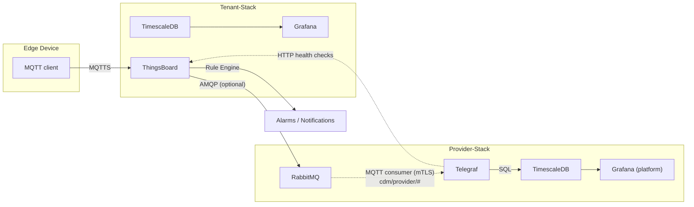

# Monitoring & Telemetry Workflow

This page covers how device metrics flow from the edge to TimescaleDB (PostgreSQL 17 +
TimescaleDB extension) and how to use the Grafana dashboards.

---

## Architecture


```mermaid
graph LR
    subgraph edge[Edge Device]
        MQC[MQTT client]
    end

    subgraph tenant[Tenant-Stack]
        TB[ThingsBoard]
        TSDB_T[TimescaleDB]
        GRF_T[Grafana]
        TSDB_T --> GRF_T
    end

    subgraph provider[Provider-Stack]
        RMQ[RabbitMQ]
        TLG[Telegraf]
        TSDB_P[TimescaleDB]
        GRF_P["Grafana (platform)"]
        TSDB_P --> GRF_P
    end

    MQC -->|MQTTS| TB
    TB -->|Rule Engine| ALM["Alarms / Notifications"]
    TB -->|"AMQP (optional)"| RMQ
    RMQ -.->|"MQTT consumer (mTLS)\ncdm/provider/#"| TLG
    TLG -->|SQL| TSDB_P
    TLG -.->|"HTTP health checks"| TB
```

**Principle:** The **Provider-Stack Telegraf** instance collects platform infrastructure
health data — it polls HTTP health endpoints for Keycloak, Grafana, IoT Bridge API,
RabbitMQ, and step-ca, collects RabbitMQ management metrics, and subscribes via
`mqtt_consumer` (mTLS) to the `cdm/provider/#` topic on RabbitMQ for system-monitor
metrics.  All data is written to the **Provider TimescaleDB** (`cdm` database) and
visualized in the provider Grafana instance.  Device telemetry (CPU, memory, sensors)
goes through **ThingsBoard** in the Tenant-Stack.

---

## Telegraf Configuration

The Telegraf config is at `provider-stack/monitoring/telegraf/telegraf.conf`. Key sections:

### Global tags

```toml
[global_tags]
  component = "provider"
```

All measurements are tagged with `component = "provider"`. There is no per-device tag;
Provider Telegraf monitors platform infrastructure, not individual devices.

### Inputs

| Plugin | Metrics | Interval |
|---|---|---|
| `http_response` | HTTP 2xx / response_time for Keycloak, Grafana, IoT Bridge API, RabbitMQ, step-ca | 60s |
| `rabbitmq` | Queue depths, message rates, connection counts (Basic Auth) | 60s |
| `mqtt_consumer` (mTLS) | Platform system metrics published on `cdm/provider/#` via RabbitMQ | on message |

The `mqtt_consumer` connects to `tls://rabbitmq:8883` using a client certificate
(CN=`telegraf`) issued by Provider step-ca.  RabbitMQ maps the CN to the `telegraf`
user via EXTERNAL SASL — no password required.

### Output — Provider TimescaleDB

```toml
[[outputs.postgresql]]
  connection = "postgresql://telegraf:${TSDB_TELEGRAF_PASSWORD}@${TSDB_HOST}:${TSDB_PORT}/${TSDB_DATABASE}?sslmode=disable"
  schema = "public"
  tags_as_foreign_keys = false
```

Telegraf automatically creates one hypertable per measurement in the `cdm` database.

---

## TimescaleDB Tables

**Tenant TimescaleDB** (`${TENANT_ID}` database) — device-facing:

| Table (hypertable) | Retention | Content |
|---|---|---|
| `device_telemetry` | 30 days | All Telegraf metrics from devices |
| `device_events` | 90 days | Device state changes, OTA events |
| `device_audit` | 90 days | Enrollment, certificate events |
| `<measurement>` | configurable | Auto-created by Telegraf per measurement |

**Provider TimescaleDB** (`cdm` database) — platform-facing:

| Table (hypertable) | Retention | Content |
|---|---|---|
| `http_response` | 30 days | HTTP health-check results (response code + time) per provider service |
| `rabbitmq` | 30 days | RabbitMQ queue depths, message rates, connection counts |
| `provider_system` | 90 days | System-monitor metrics from `cdm/provider/#` MQTT topic |
| `<measurement>` | configurable | Auto-created by Telegraf per MQTT measurement name |

Tables and hypertables are created automatically by `monitoring/timescaledb/init-scripts/01-init-schema.sh`.
Telegraf creates additional tables on first write.

---

## Grafana Dashboards

Grafana is pre-provisioned with the **System Monitor** dashboard.

### System Monitor

The System Monitor dashboard (`provider-stack/monitoring/grafana/dashboards/system-monitor.json`)
shows provider infrastructure health:

- CPU load averages (1m / 5m / 15m) — timeseries + gauge
- RAM used % — timeseries + gauge + current value

All queries read from the `provider_system` hypertable:

```sql
SELECT time AS "time",
       cpu_load_1m AS "1m",
       cpu_load_5m AS "5m",
       cpu_load_15m AS "15m"
FROM provider_system
WHERE $__timeFilter(time)
ORDER BY time;
```

The datasource type is **`grafana-postgresql-datasource`** (not the legacy `postgres` type)
with `timescaledb: true` set in `jsonData`.

---

## Alerting

ThingsBoard handles **device-level alerting** (offline devices, alarms, OTA status changes).

Grafana can alert on **Provider infrastructure health** using data in TimescaleDB:

- Service endpoint down (no successful `http_response` for 5 min) → Grafana Alert
- RabbitMQ queue depth exceeding threshold → warning alert

---

## Troubleshooting

| Symptom | Cause | Fix |
|---|---|---|
| No metrics in TimescaleDB | Telegraf can't reach TimescaleDB | Check `TSDB_DATABASE`, `TSDB_TELEGRAF_PASSWORD` in `provider-stack/.env` |
| Grafana shows "No data" | Wrong table name or time range | Verify table is `http_response`, `rabbitmq`, or `provider_system`; widen time range |
| ThingsBoard telemetry stops | MQTT client disconnected | Check `mqtt-client` logs; verify cert validity |
| Telegraf MQTT consumer errors | mTLS cert not issued | `docker compose restart mqtt-certs-init telegraf` |
| Telegraf: `password authentication failed` | Wrong `TSDB_TELEGRAF_PASSWORD` | Check `.env` and run `docker compose restart telegraf` |
