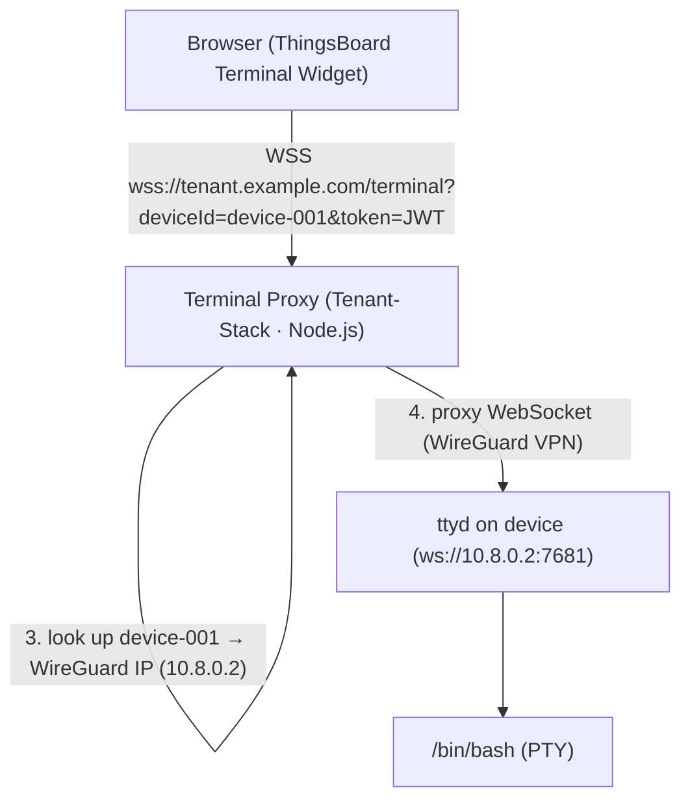

# Remote Access Workflow

This page explains how to open a secure browser-based terminal on a remote device.

!!! info "Tenant-Stack components"
    WireGuard and Terminal Proxy are part of the **Tenant-Stack**.  The device must be
    enrolled against the Tenant step-ca and connected to the Tenant WireGuard server.

---

## How It Works



The device is only reachable via the WireGuard VPN — it has no direct internet exposure.

---

## Prerequisites

- The device must be enrolled and connected to the Tenant WireGuard VPN.
- `ttyd` must be running on the device (port 7681, bound to the WireGuard interface only).
- The terminal-proxy (Tenant-Stack) must be running and healthy.
- The operator must have a valid Keycloak JWT with role `cdm-operator` or `cdm-admin` in the Tenant realm.

---

## Opening a Terminal from ThingsBoard

1. In ThingsBoard, open the dashboard for your device.
2. The **Terminal** custom widget is embedded in the dashboard.
3. The widget automatically fetches the JWT from ThingsBoard's auth context.
4. Click **Connect** — a terminal session opens in the browser.

---

## Opening a Terminal Directly (curl / wscat)

For testing or automation:

```bash
# Install wscat
npm install -g wscat

# Get a Keycloak token from the Tenant Keycloak
TENANT=https://tenant.example.com
TOKEN=$(curl -s -X POST \
  "$TENANT/auth/realms/tenant-acme/protocol/openid-connect/token" \
  -d "grant_type=password&client_id=terminal-proxy&username=operator&password=<pw>" \
  | grep -o '"access_token":"[^"]*' | cut -d'"' -f4)

# Connect to the terminal proxy
wscat --connect "$TENANT/terminal?deviceId=device-001&token=$TOKEN"
```

---

## ttyd Setup on a Real Device

Install and configure ttyd so it only listens on the WireGuard interface:

```bash
# On the device (run as root)
bash /opt/cdm/terminal/setup.sh
```

The setup script:

1. Installs `ttyd` from the system package manager.
2. Creates `/etc/systemd/system/ttyd.service` bound to the `wg0` interface.
3. Sets the credential: username `cdm`, password from `CDM_TTYD_PASSWORD` env var.
4. Enables and starts the service.

!!! warning "Security"
    ttyd exposes a shell. Always:
    - Bind to the WireGuard interface only (never `0.0.0.0`).
    - Use a strong, unique password.
    - Consider disabling password auth and requiring the JWT-validated proxy.

---

## Terminal Proxy Configuration

| Environment Variable | Description | Default |
|---|---|---|
| `PORT` | Proxy listen port | `8888` |
| `KEYCLOAK_JWKS_URI` | Keycloak JWKS endpoint | (required) |
| `KEYCLOAK_AUDIENCE` | Expected JWT `aud` claim | `thingsboard` |
| `REQUIRED_ROLE` | JWT role required to connect | `cdm-operator` |
| `PEERS_DB_PATH` | Path to `cdm_peers.json` | `/wg-config/cdm_peers.json` |
| `TTYD_PORT` | ttyd port on devices | `7681` |

---

## Troubleshooting

| Symptom | Cause | Fix |
|---|---|---|
| `401 Unauthorized` in browser | Token expired or wrong audience | Re-login to ThingsBoard; check `KEYCLOAK_AUDIENCE` |
| `404 Device not found` | Device not in `cdm_peers.json` | Re-enroll device; check `PEERS_DB_PATH` |
| WebSocket connects but terminal is blank | ttyd not running on device | SSH in and check `systemctl status ttyd` |
| Terminal disconnects after a few seconds | WireGuard tunnel lost | Check device WG status: `wg show` |
