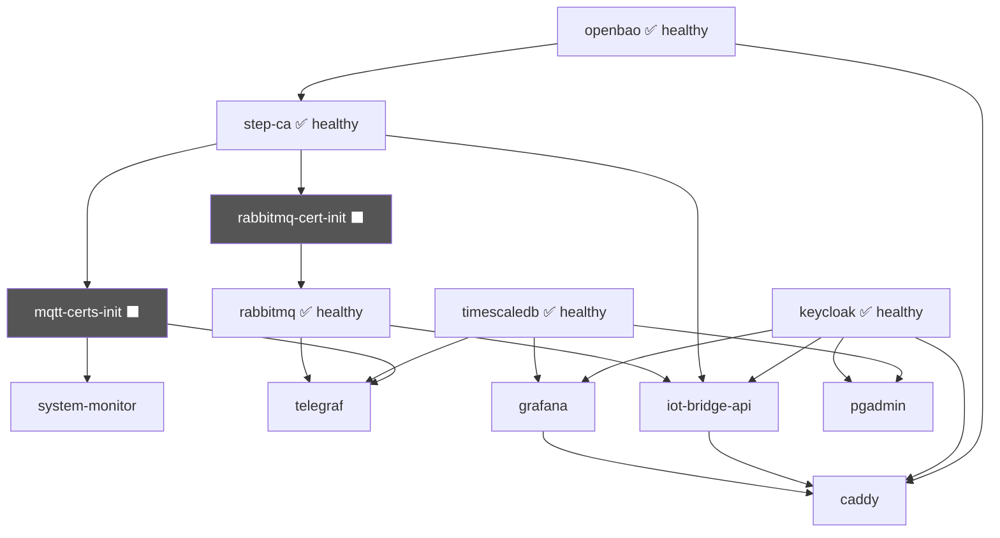

# Provider-Stack Setup (Codespaces / Dev)

This guide describes the complete, reproducible procedure for a **clean rebuild** of the
Provider-Stack in Codespaces — including initial cleanup, PKI initialization, and smoke test.

## Target State

At the end, all Provider services should be running stably with:

- `provider-step-ca` (`healthy`)
- `provider-keycloak` (`healthy`)
- `provider-rabbitmq` (`healthy`)
- `provider-timescaledb` (`healthy`)
- `provider-openbao` (`healthy`) — auto-initialized on first start (Transit key + AppRole)
- `provider-caddy`, `provider-grafana`, `provider-iot-bridge-api`, `provider-pgadmin`, `provider-telegraf` (`Up`)
- `provider-rabbitmq-cert-init`, `provider-mqtt-certs-init` as one-shots with `Exited (0)`
- `provider-system-monitor` (`Up`)  — publishes CPU load + RAM metrics every 5 s via MQTT+mTLS

## 1) Create `.env` and set the Codespaces URL

```bash
cd provider-stack
cp .env.example .env
```

Set at least the following in `.env`:

```dotenv
EXTERNAL_URL=https://<codespace-name>-8888.app.github.dev
PGADMIN_EMAIL=admin@cdm-platform.dev
```

Notes:

- Get `<codespace-name>` by running `echo $CODESPACE_NAME`.
- `PGADMIN_EMAIL` must **not use a reserved domain** such as `.local`.

## 2) Initial Cleanup (complete)

```bash
docker compose down --volumes --remove-orphans
```

This starts from a clean state (containers, networks, and volumes removed).

## 3) Start `step-ca` first

```bash
docker compose up -d step-ca
```

Wait until the container is `healthy`:

```bash
docker compose ps step-ca
```

## 4) Initialize provisioners and update `.env` (run once)

```bash
./scripts/init-pki.sh
```

This runs `init-provisioners.sh` inside the step-ca container (creates `iot-bridge` and
`tenant-sub-ca-signer` provisioners if they don't exist yet) and automatically writes
the resulting values — `STEP_CA_FINGERPRINT`, `STEP_CA_PROVISIONER_NAME`, etc. — into `.env`.

!!! tip "Manual re-run"
    Run `./scripts/init-pki.sh` again at any time to re-apply provisioner settings or
    refresh the fingerprint in `.env` (the operation is idempotent).

## 5) Copy OpenBao AppRole credentials to `.env`

```bash
./scripts/init-openbao.sh
```

This reads `role_id` and `secret_id` from `/openbao/data/step-ca-approle.json` inside the
running `provider-openbao` container and writes `OPENBAO_STEP_CA_ROLE_ID` and
`OPENBAO_STEP_CA_SECRET_ID` into `.env` automatically.

Pass `--with-root-token` to also write `OPENBAO_ROOT_TOKEN` (useful for manual vault
operations):

```bash
./scripts/init-openbao.sh --with-root-token
```

> **Note:** On subsequent starts, OpenBao auto-unseals from `/openbao/data/.init.json` —
> no manual action required. `OPENBAO_MODE=embedded` (default) is sufficient for all
> development and single-node testing scenarios.

## 6) Start the full stack

```bash
docker compose up -d
```

Check status:

```bash
docker compose ps -a
```

The start-up order is controlled by `depends_on` conditions:



`mqtt-certs-init` issues client certificates (CN=`system-monitor` and CN=`telegraf`) from
the Provider step-ca into the shared `mqtt-client-tls` volume.  Both services use these
certs for **mTLS authentication** against RabbitMQ (EXTERNAL auth — no username/password).

## 7) Quick smoke test of endpoints

```bash
python3 - <<'PY'
import subprocess
base='http://localhost:8888'
endpoints=['/auth/','/grafana/','/api/health','/rabbitmq/','/pki/health','/pgadmin/']
print(f'Smoke test base: {base}')
for ep in endpoints:
    p = subprocess.run(['curl','-sS','-o','/dev/null','-w','%{http_code}', base+ep], capture_output=True, text=True, timeout=20)
    code = (p.stdout or '').strip() or '000'
    status = 'OK' if code.startswith(('2','3')) else 'FAIL'
    print(f'{status} {ep} -> HTTP {code}')
PY
```

Expected: all endpoints return `2xx` or `3xx`.

## Common Errors & Direct Fixes

### `provider-pgadmin`: invalid email address

Symptom: `admin@cdm.local` is rejected as a special-use/reserved domain.

Fix in `.env`:

```dotenv
PGADMIN_EMAIL=admin@cdm-platform.dev
```

Then restart:

```bash
docker compose up -d pgadmin
```

### `provider-rabbitmq-cert-init`: `STEP_CA_FINGERPRINT is not set`

Fix:

1. Read the fingerprint as described above.
2. Set it in `.env` at `STEP_CA_FINGERPRINT`.
3. Then run:

```bash
docker compose up -d rabbitmq-cert-init rabbitmq
```

### `provider-rabbitmq-cert-init`: `invalid value 'iot-bridge' for flag '--provisioner'`

Cause: The `iot-bridge` provisioner has not been created yet.

Fix:

```bash
docker exec provider-step-ca /usr/local/bin/init-provisioners.sh
docker compose up -d rabbitmq-cert-init rabbitmq
```

### `provider-mqtt-certs-init`: `STEP_CA_FINGERPRINT is not set`

Same root cause as the RabbitMQ cert-init.  Fix identically (steps 4 and 5 above), then:

```bash
docker compose up -d mqtt-certs-init system-monitor telegraf
```

### `provider-system-monitor`: keeps reconnecting

This service starts when `mqtt-certs-init` completes and `rabbitmq` is healthy, but
RabbitMQ may still be loading definitions.  The monitor retries automatically — no action
required.  Check logs if it does not stabilise after ~30 s:

```bash
docker compose logs --tail=40 system-monitor
```

### MQTT mTLS: `unsuitable certificate purpose` / `Client identifier not valid`

Two known issues can occur on a fresh setup:

**`unsuitable certificate purpose`** — Python 3.13 enforces `serverAuth` EKU on the TLS
server certificate.  The `iot-bridge` provisioner must use `service-leaf.tpl` (which
includes both `serverAuth` and `clientAuth`).  If step-ca was provisioned with the old
`device-leaf.tpl` for `iot-bridge`, update it:

```bash
docker exec provider-step-ca sh -lc '
step ca provisioner update iot-bridge \
  --x509-template /home/step/templates/service-leaf.tpl \
  --x509-max-dur 8760h \
  --admin-subject step \
  --admin-provisioner "${DOCKER_STEPCA_INIT_PROVISIONER_NAME}" \
  --admin-password-file /run/secrets/step-ca-password
'
# Then force re-issue of all TLS certs:
docker run --rm -v provider-stack_rabbitmq-tls:/tls alpine rm /tls/server.crt /tls/server.key
docker compose up -d --force-recreate rabbitmq-cert-init mqtt-certs-init rabbitmq telegraf system-monitor
```

**`Client identifier not valid`** — RabbitMQ 4.x validates that the MQTT CONNECT client-id
matches the cert's Subject Alternative Name (SAN). This is enforced by `mqtt.ssl_cert_client_id_from = subject_alternative_name` in `rabbitmq.conf`.
Python clients must use `protocol=MQTTv311` (paho-mqtt 2.x defaults to MQTTv5 which has
different CONNACK semantics).  Both are already configured in the current codebase.

### `provider-telegraf` restart loop due to `outputs.postgresql`

With Telegraf `1.37`, certain fields (`create_metrics_table_if_not_exists`, `timescaledb`
block) are not available.

Fix: remove these fields from `monitoring/telegraf/telegraf.conf` (already applied in the
current state).

### `provider-openbao`: `permission denied` on `/openbao/data/vault.db`

Symptom in logs:

```
error initializing storage of type raft: failed to create fsm:
  failed to open bolt file: open /openbao/data/vault.db: permission denied
```

Cause: Docker created the named volume with `root` ownership before the container could
set it up (e.g. after an aborted first start or when using an old image without the
`mkdir/chown` fix in the Dockerfile).

Fix: Remove the container and volume so Docker re-initialises with correct ownership:

```bash
docker compose stop openbao
docker compose rm -f openbao
docker volume rm provider-stack_openbao-data
docker compose up -d openbao
```

### `provider-openbao`: `unable to find user vault`

Symptom:

```
Error response from daemon: unable to find user vault: no matching entries in passwd file
```

Cause: The `openbao/openbao` base image uses the username **`openbao`**, not `vault`
(which was the username in the original HashiCorp Vault).  The `Dockerfile` had
`USER vault` instead of `USER openbao`.

Fix (already applied in the current codebase): rebuild the image:

```bash
docker compose build --no-cache openbao
docker compose up -d openbao
```

## Useful Quick Commands

```bash
# Overall status
docker compose ps -a

# Logs for a service
docker compose logs --no-color --tail=120 <service>

# Full reset
docker compose down --volumes --remove-orphans && docker compose up -d
```
